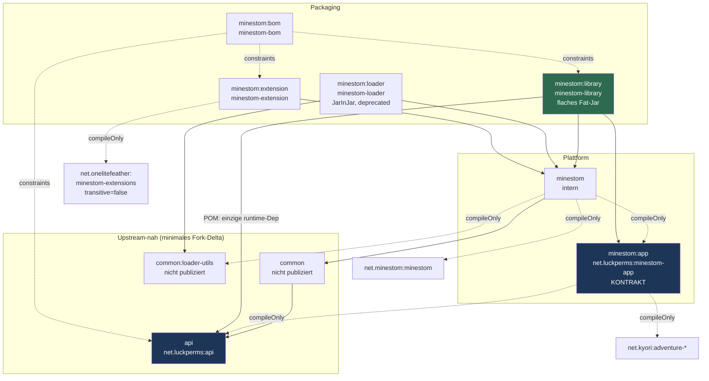

# LuckPerms auf Minestom — Analyse und Umbauplan

**Stand:** 2026-08-04 · **Repo:** `OneLiteFeatherNET/LuckPerms`, Branch `master`, Worktree `minestom-maintainability-research`
**Ziel des Auftraggebers:** LuckPerms in eigene Minestom-Projekte einbinden — (a) als **Library**, die der Konsument per ShadowJar in sein Fat-Jar shaded, oder (b) als **Extension** über `OneLiteFeatherNET/minestom-extensions`. Dabei soll der Code wartbarer werden und Upstream-Merges müssen weiter möglich bleiben.

Alle Aussagen in diesem Dokument sind am Repo bzw. an den Artefakten im lokalen Gradle-Cache nachgeprüft. Wo eine Prüfung nicht möglich war (kein Netzzugriff), steht das explizit dabei.

---

## 1. Ausgangslage

Der Minestom-Zweig ist eine Portierung des `standalone/`-Musters, also des einzigen LuckPerms-Moduls, das den JVM-Prozess selbst besitzt. Genau das ist die Wurzel der meisten Probleme: der Code ist als „ich bin der Server" geschrieben, nicht als Bibliothek in einem fremden Prozess. Er besteht aus **12 Java-Dateien / 1073 Zeilen** (`find minestom -name '*.java' -path '*/src/*'`) und hat **null Tests** (`find minestom -path '*src/test*' -name '*.java'` → leer).

Der Build läuft ausschließlich auf Minestom: `settings.gradle` inkludiert nur noch `api`, `common`, `common:loader-utils`, `minestom`, `minestom:loader`, `minestom:app`. Die 21 übrigen Upstream-Module liegen im Baum, werden aber nicht kompiliert.

Die Einbindung erfolgt heute programmatisch über `MinestomLoader.get().load().registerShutdownHook().start()` nach `MinecraftServer.init()`. Es existiert kein Extension-Entrypoint (die in `extension.json` referenzierte Klasse gibt es nicht) und keine Konfigurationsfläche: Datenverzeichnis, Logger-Name, Command-Aliase und Dependency-Beschaffung sind fest verdrahtet.

Wichtigster Einzelbefund vorweg: **die aktuelle Fassung kann so nicht laufen** — 95 Dateien in `common/src/main/java` importieren `com.google.common`, aber weder das jarinjar noch das Loader-Jar noch Minestom liefern Guava, und `Dependency` kennt keinen `GUAVA`-Eintrag (siehe B-1).

### Module und publizierte Artefakte

| Gradle-Pfad | Publizierte Koordinate | Inhalt / Rolle | Publiziert von CI? |
|---|---|---|---|
| `:api` | `net.luckperms:api` | LuckPerms-API (Build-Gruppe ist `me.lucko.luckperms`) | **nein** |
| `:common` | `net.luckperms:common` | Kern; exportiert gson 2.7, guava 19.0, okhttp 3.14.9, Adventure 5.1.1 in `compile`-Scope | **nein** |
| `:common:loader-utils` | `net.luckperms:loader-utils` | `JarInJarClassLoader`, `LoaderBootstrap` | **nein** |
| `:minestom` | `net.luckperms:minestom` | Plattformimplementierung (12 Klassen). Publiziert ein 30-KB-Thin-Jar **plus** das `luckperms-minestom.jarinjar` als Variante `-all` | ja |
| `:minestom:app` | `net.luckperms:minestom-app` | 1 Klasse mit `getVersion()`; exportiert 7 Adventure-Artefakte als `api` | ja |
| `:minestom:loader` | `net.luckperms:minestom-loader` | ShadowJar `LuckPerms-Minestom-<ver>.jar`, enthält `luckperms-minestom.jarinjar`, `net/luckperms/api/**`, `extension.json` | ja |

> `.github/workflows/ci.yml:38` baut `./gradlew :minestom:loader:build` (ohne Tests), `:44` publiziert `:minestom :minestom:app :minestom:loader`. `:api` und `:common` werden nie publiziert, obwohl die POM von `net.luckperms:minestom` auf `net.luckperms:common` verweist.

---

## 2. Befunde

Sortiert nach Schwere. Jeder Befund ist mit `Datei:Zeile` oder einem reproduzierten Kommando belegt. Befunde aus der Vorrecherche, die sich bei der Nachprüfung als falsch erwiesen haben, sind **nicht** aufgenommen — siehe Abschnitt 2.4.

### 2.1 Blockiert BEIDE Routen

#### B-1 · Guava fehlt zur Laufzeit — LuckPerms-Minestom startet nicht (blocker)

95 Dateien unter `common/src/main/java` importieren `com.google.common` (`grep -rl "com.google.common" common/src/main/java | wc -l` → 95), darunter `DependencyRegistry` direkt im Load-Pfad. Aber:

- `minestom/build.gradle:23-27` bundelt nur `me.lucko.luckperms:.*` — `unzip -Z1 minestom/build/libs/luckperms-minestom.jarinjar | grep -c com/google/common` → **0**
- `Dependency.java` hat keinen `GUAVA`-Eintrag (`grep -n GUAVA` → rc=1) — es kann also auch nicht nachgeladen werden
- Minestom liefert Guava nicht: die Gradle-Module-Metadata von `net.minestom:minestom:2026.07.12-26.2` listet in `runtimeElements` slf4j, data, fastutil, flare, jctools, annotations, Adventure 5.2.0 und gson 2.14.0 — **kein Guava**

Ergebnis: `NoClassDefFoundError: com/google/common/collect/ImmutableSet` beim ersten Zugriff, sofern der Host Guava nicht zufällig selbst mitbringt.

**Upstream liefert zwei Muster** — und nur eines davon funktioniert hier. `hytale/build.gradle:13,28,32` bundelt Guava **reloziert** (`relocate 'com.google.common' → me.lucko.luckperms.lib.guava`), `standalone/app/build.gradle:18` bundelt es **unreloziert** (`com.google.guava:guava:33.4.8-jre`).

> **Korrektur 2026-08-04 (bei der Umsetzung gefunden, nachverifiziert):** Hier stand ursprünglich, das Hytale-Muster sei zu übernehmen und der Fix „drei Zeilen". **Das Hytale-Muster bricht auf Minestom den Start.** Umgesetzt und reproduziert:
> ```
> NoClassDefFoundError: com/google/common/base/Splitter
>   at me.lucko.luckperms.lib.configurate.loader.AbstractConfigurationLoader.<clinit>
> ```
> Ursache: Die zur Laufzeit heruntergeladenen Dependencies werden mit den Regeln aus `Dependency.java` remapped, und **für `com.google.common` existiert nirgends eine `Relocation`** (verifiziert: der einzige Treffer in `Dependency.java` ist ein `import`, `RelocationHelper` kennt keine). Configurates Guava-Referenzen bleiben damit unreloziert und laufen ins Leere, sobald die Config gelesen wird.
>
> **Richtig ist das `standalone`-Muster: Guava bundeln, aber _nicht_ relozieren.** Unbedenklich, weil der JarInJar-Classloader parent-first delegiert — ein Host mit eigenem Guava gewinnt weiterhin, unsere Kopie leakt nie auf den Host-Classpath.
>
> *Nebenbefund für Upstream:* `hytale/` trägt denselben latenten Defekt. Er fällt dort nur nicht auf, weil der Hytale-Server Guava selbst mitbringt.

#### B-2 · Permission-Brücke fehlt in beide Richtungen — nur die Konsole kann `/lp` (blocker)

`MinestomSenderFactory.java:79` und `:88` lesen `sender.getOrDefault(PermissionChecker.POINTER, PermissionChecker.always(TriState.FALSE))`. Der Pointer wird nirgends gesetzt:

- `javap net.minestom.server.entity.Player` (aus `minestom-2026.05.17-1.21.11.jar`): nur `getPermissionLevel()` / `setPermissionLevel(int)`, keine String-Permissions
- `Player.java:125-130` (Sources): `PLAYER_POINTERS_SUPPLIER` löst nur `Identity.NAME`, `Identity.DISPLAY_NAME`, `Identity.LOCALE` auf — und ist `protected static final`
- `ConsoleSender.java:18-20`: nur `Identity.UUID`

`LPMinestomPlugin.java:148-150` (`setupPlatformHooks`) und `:158-160` (`registerApiOnPlatform`) sind leere Stubs. Damit ist jeder Spieler-Check konstant `FALSE`; nur die Konsole kommt über den `isConsole()`-Kurzschluss in `AbstractSender` durch.

Zusatzbefund: `getPermissionValue` ruft `PermissionChecker.test(node)`. `javap` gegen `adventure-api-5.1.1.jar` zeigt `public abstract TriState value(String)` und `public default boolean test(String)` — `test()` ist die geerbte `Predicate`-Methode und kollabiert `NOT_SET` zu `FALSE`.

Weil `PLAYER_POINTERS_SUPPLIER` `protected static final` ist, kann der Pointer auf einer bestehenden `Player`-Instanz **nicht** nachgerüstet werden. Die Brücke muss also andersherum gebaut werden: LuckPerms fragt sich selbst.

#### B-3 · Kein Integrationspunkt für Minestom-eigene Commands (blocker für den Nutzen)

Der richtige Andockpunkt wäre `Command#setCondition(CommandCondition)`. `MinestomCommandExecutor.LuckPermsCommand` (`:58-63`) registriert `/luckperms|lp|perm|perms|permission|permissions` ohne jede Condition. Es gibt keine öffentliche Factory, mit der ein Konsument seine eigenen Commands gegen LuckPerms absichern könnte. Minestom ruft `canUse(sender, null)` zusätzlich beim Connect für die Tab-Complete-Sichtbarkeit auf — Sichtbarkeit und Ausführung wären damit in einem Zug abgedeckt.

### 2.2 Blockiert die Library-Route

#### L-1 · `JarInJarClassPathAppender` wirft unter jedem anderen ClassLoader (blocker)

`LPMinestomBootstrap.java:72` konstruiert unbedingt `new JarInJarClassPathAppender(getClass().getClassLoader())`. `JarInJarClassPathAppender.java` wirft im Konstruktor `IllegalArgumentException("Loader is not a JarInJarClassLoader: ...")`, sobald der ClassLoader keiner ist. Beim Shading in ein Konsumenten-Fat-Jar läuft alles unter dem AppClassLoader → sofortiger Abbruch.

**Der Fix kostet keine neue Klasse.** `ClassPathAppender` ist ein Functional Interface (eine abstrakte Methode `addJarToClasspath(Path)`, `close()` ist `default`), und Upstream nutzt genau das bereits: `standalone/src/test/java/me/lucko/luckperms/standalone/utils/TestPluginBootstrap.java:56` — `private static final ClassPathAppender NOOP_APPENDER = file -> {};`

> **Invariante, die überall fehlt:** Ein No-Op-Appender ist nur korrekt, wenn LuckPerms nichts nachlädt. `AbstractLuckPermsPlugin` reicht heruntergeladene Dependencies ausschließlich über `getClassPathAppender()` weiter. „No-Op-Appender + Download-Modus" heißt: Jars werden geladen, verifiziert, reloziert und dann still verworfen → `NoClassDefFoundError` ohne Fehlermeldung. Der Builder muss diese Kombination hart ablehnen.

#### L-2 · `net.luckperms:minestom` ist nicht auflösbar publiziert (blocker)

`ci.yml:44` publiziert nur `:minestom :minestom:app :minestom:loader`; `publish` propagiert nicht auf abhängige Projekte. Die generierte POM von `net.luckperms:minestom` deklariert `net.luckperms:common:5.6-SNAPSHOT`, die von `minestom-app` deklariert `net.luckperms:api:5.6-SNAPSHOT` — beide werden nie geschoben. Ein Konsument bekommt einen Resolve-Fehler.

#### L-3 · `net.luckperms:common` exportiert gson 2.7 / guava 19.0 / Adventure in `compile`-Scope (blocker)

`common/build.gradle:93-94`: `api 'com.google.code.gson:gson:2.7'`, `api 'com.google.guava:guava:19.0'`. Dazu `:61-90` sechs Adventure-Artefakte 5.1.1, jeweils mit `exclude(module: 'adventure-bom')`. Das ist die konkrete Quelle sowohl des Gson-Konflikts als auch des Exclude-Zwangs beim Konsumenten.

**Wichtig — der naheliegende Fix geht nicht:** `api` → `compileOnly` in `common/build.gradle` würde `:minestom` brechen, weil `MinestomConfigAdapter.java:30-32` direkt `ninja.leaping.configurate.{ConfigurationNode,loader.ConfigurationLoader,yaml.YAMLConfigurationLoader}` importiert und Configurate ausschließlich transitiv über common's `api`-Scope sieht. Der richtige Zug ist, `net.luckperms:common` schlicht **nicht mehr zu publizieren** (Upstream publiziert es ebenfalls nie) — null Fork-Delta in `common/build.gradle`.

#### L-4 · JarInJar und Konsumenten-ShadowJar sind strukturell unvereinbar (blocker)

`MinestomLoader.java:34-35` hält `JAR_NAME = "luckperms-minestom.jarinjar"` und `BOOTSTRAP_CLASS = "me.lucko.luckperms.minestom.LPMinestomBootstrap"` als String-Konstanten. Shadow schreibt String-Konstanten relozierter Pakete mit um; das genestete `.jarinjar` ist für Shadow dagegen ein opaker Binärblob. Reloziert der Konsument `me.lucko.luckperms`, sucht der Loader eine Klasse, die im Blob unverändert unter dem alten Namen liegt → `ClassNotFoundException`, erst zur Laufzeit sichtbar. Reloziert er nicht, schleppt er 1,4 MB toten Ballast mit, denn LuckPerms lädt seine echten Dependencies ohnehin nach.

**Konsequenz:** Route (a) braucht ein **flaches** Fat-Jar ohne JarInJar.

#### L-5 · `org.gradle.jvm.version=25` sperrt Java-21-Konsumenten aus (hoch)

`minestom/build.gradle:62-64`, `minestom/app/build.gradle:13-15`, `minestom/loader/build.gradle:24-26` setzen jeweils `options.release = 25`. Das landet in der Gradle-Module-Metadata. `common` ist auf 21, `api` auf 8, Root auf 11 — die drei Minestom-Module sind die einzigen auf 25. Minestom selbst läuft ab Java 21.

Geprüft: `./gradlew :minestom:compileJava` läuft sauber, und eine Suche über `minestom/**` fand keine Java-22+-Sprachfeatures. Die Absenkung auf `release = 21` (Toolchain darf 25 bleiben) ist machbar — **muss aber mit dem Auftraggeber abgestimmt werden**, weil sie der Fork-Vorgabe „Java 25" widerspricht.

### 2.3 Blockiert die Extension-Route

#### E-1 · `extension.json` zeigt auf eine nicht existierende Klasse (blocker)

`minestom/loader/src/main/resources/extension.json:2` deklariert `"entrypoint": "me.lucko.luckperms.minestom.loader.MinestomLoaderExtension"`. `find . -name "MinestomLoaderExtension.java"` → **kein Treffer**. Im Package liegt nur `MinestomLoader.java`, das kein Extension-Interface implementiert.

Die Datei landet trotzdem im Root **jedes** gebauten Loader-Jars (`unzip -Z1 minestom/loader/build/libs/LuckPerms-Minestom-5.6.55.jar` → `extension.json` vorhanden). Das Library-Artefakt gibt sich damit fälschlich als ladbare Extension aus.

Zusätzlich fehlt jede Voraussetzung: `minestom/loader/build.gradle:10-16` deklariert nur `net.minestom:minestom`, `:api`, `:common:loader-utils`, `:minestom:app`. `net.onelitefeather:minestom-extensions` ist nirgends im Build — `net.minestom.server.extensions.Extension` steht also gar nicht auf dem Compile-Classpath.

#### E-2 · `net.luckperms:api` liegt doppelt (hoch)

`unzip -Z1 minestom/build/libs/luckperms-minestom.jarinjar | grep -c "^net/luckperms/"` → **237** Einträge. Zusätzlich hat `minestom/loader/build.gradle:13` `implementation project(':api')`, die API liegt also auch im äußeren Jar.

`JarInJarClassLoader` delegiert **parent-first** (`loadClass(String,boolean)` ruft `super.loadClass`, solange `priorityPackagePrefixes == null` — und das setzt niemand im Repo). Wenn der Host `net.luckperms:api` deklariert, gewinnt also die Host-Kopie und `LuckPermsProvider.get()` funktioniert. Ohne Host-Kopie läuft LuckPerms mit seiner eigenen. Das ist ein **Größen- und Sauberkeitsproblem, kein Korrektheitsproblem** — siehe die Korrektur in 2.4.

Wenn eine Priorisierung doch nötig wird, gibt es dafür einen von LuckPerms selbst gebauten Hebel: `JarInJarClassLoader.setPriorityPackagePrefixes(List<String>)` (`:74-75`, ausgewertet in `loadClass` `:166-193`). Er ist in keiner Option erwähnt worden.

#### E-3 · `minestom-extensions:2.0.0` ist extern nicht auflösbar *(unverifiziert — kein Netzzugriff)*

Aus der Vorrecherche: `net.onelitefeather:minestom-extensions:2.0.0` zieht `net.onelitefeather:mycelium-bom:1.7.1` (öffentlich HTTP 404, geschützte Repos 401) und `com.github.Minestom:DependencyGetter:v1.0.1` (nur JitPack, plus Shrinkwrap/Aether-Stack von 2019) nach. **Konnte in dieser Umgebung nicht nachgeprüft werden** (kein Netzzugriff). Muss vor der Umsetzung verifiziert werden.

Wichtig, falls es zutrifft: `compileOnly` wird transitiv aufgelöst (`compileClasspath extends compileOnly`), d. h. ohne `transitive = false` bricht schon **unser eigener** Build, nicht nur der des Konsumenten.

### 2.4 Korrekturen zur Vorrecherche

Diese Punkte kursierten als Fakten, halten der Prüfung aber **nicht** stand:

| Behauptung | Befund |
|---|---|
| „`exclude(dependency('net.luckperms:api'))` holt die API aus dem jarinjar" | **Falsch.** `build.gradle:15` setzt `group = 'me.lucko.luckperms'` für alle Subprojekte; `net.luckperms` existiert nur als `groupId` in den Publikationsblöcken. Die vorhandene Zeile `include(dependency('net.luckperms:.*'))` in `minestom/build.gradle:24` ist bereits heute **toter Code**. Wirksam wäre nur `me.lucko.luckperms:api`. |
| „Die jarinjar-Kopie von `LuckPermsProvider` gewinnt über die Host-Kopie" | **Falsch.** `JarInJarClassLoader` delegiert parent-first (`loadClass` → `super.loadClass`, `priorityPackagePrefixes` ist im Repo nie gesetzt). Die **Parent-Kopie** gewinnt. |
| „Der Pointer lässt sich per `player.pointers()`-Erweiterung nachrüsten (Best-Effort)" | **Nicht belegbar.** `PLAYER_POINTERS_SUPPLIER` ist `protected static final`, `Pointers` bietet keine Mutations-API. Behandele das als *nicht möglich*, bis jemand es an einer konkreten Minestom-Version zeigt. |
| „Aliase lassen sich zur Laufzeit einzeln überspringen" | **Nur teilweise.** `LuckPermsCommand` übergibt alle sechs Namen im `super(...)`-Aufruf an `Command(String, String...)`; `register()` ist ein einziger Aufruf. Gefiltert werden kann nur **vor** der Konstruktion. |
| „Das Loader-Jar bringt ein veraltetes, unreloziertes Gson mit" | **Für den aktuellen Stand falsch.** `unzip -Z1 LuckPerms-Minestom-5.6.55.jar | grep com/google/gson` → 0 Treffer, im jarinjar ebenfalls 0. Das Problem stammt aus dem Maven-Metadatenpfad über `net.luckperms:common` (L-3), nicht aus dem Jar. **Welche Artefaktversion die betroffenen Konsumenten tatsächlich auflösen, ist ungeprüft** — das gehört verifiziert, bevor der Exclude aus der Doku gestrichen wird. |

### 2.5 Kostet Wartung

| # | Befund | Beleg |
|---|---|---|
| W-1 | `getServerVersion()` liefert eine **einkompilierte Konstante**. `MinecraftServer.VERSION_NAME` ist kein Feld von `MinecraftServer` (`javap` zeigt nur `getBrandName`/`setBrandName`), sondern eine geerbte `static final String`-Konstante. `javap -c LPMinestomBootstrap.class` → `getServerVersion(): ldc "1.21.11"; areturn`. Auf einem Host mit Minestom 26.2 meldet `/lp info` weiterhin 1.21.11 — still falsch, ohne Compile-Fehler. | `LPMinestomBootstrap.java:146` |
| W-2 | **Datenverzeichnis hardcodiert** auf `Paths.get("data").toAbsolutePath()` — 1:1 von `LPStandaloneBootstrap` geerbt. `getConfigDirectory()` hat einen Default, der darauf zeigt (`LuckPermsBootstrap.java:152`). Damit landen config.yml, H2-DB, translations/ und der libs/-Cache zwingend im CWD des fremden Servers. Kein Parameter, kein Override. | `LPMinestomBootstrap.java:150-151` |
| W-3 | **Statischer ConsoleSender-Initializer** erzwingt `MinecraftServer.init()` vor dem bloßen Klassenladen. Da `LPMinestomBootstrap` im Konstruktor `new LPMinestomPlugin(this)` aufruft, genügt ein `MinestomLoader.get()` zu früh für einen `ExceptionInInitializerError` tief im Reflection-Pfad. | `LPMinestomPlugin.java:67` |
| W-4 | **Kein Deregistrieren beim Disable.** `removePlatformHooks()` (Hook: `AbstractLuckPermsPlugin.java:377`, leerer Default) wird nicht überschrieben. `MinestomCommandExecutor.unregister()` (`:54-56`) ist toter Code. Die Listener hängen per `addListener(Class, Consumer)` am `GlobalEventHandler` — diese Überladung gibt die `EventListener`-Instanz nicht zurück, `removeListener()` ist damit prinzipiell unmöglich. Kein Neustart im selben Prozess, keine Tests. | `MinestomConnectionListener.java:50-53` |
| W-5 | **Kein Disconnect-Handling.** Registriert sind nur `AsyncPlayerPreLoginEvent` und `AsyncPlayerConfigurationEvent`. `grep -rn handleDisconnect minestom/src` → **0 Treffer**, obwohl `AbstractConnectionListener.java:114` die Methode bereitstellt. Transiente Nodes werden nie geleert, User nie entladen. | `MinestomConnectionListener.java:52-53` |
| W-6 | **Greedy Alias-Registrierung.** `super("luckperms", "lp", "perm", "perms", "permission", "permissions")`. Minestoms `CommandManager.register` wirft bei belegtem Namen `IllegalStateException` → ein Host mit eigenem `/perms` lässt `enable()` mit einer ungefangenen Exception abbrechen. Velocity nimmt bewusst `luckpermsvelocity`/`lpv`. | `MinestomCommandExecutor.java:61` |
| W-7 | **`config.yml` liegt im Jar-Root** (`ls minestom/src/main/resources/` → nur `config.yml`; auch im jarinjar-Root nachgewiesen). Beim Shading kollidiert sie direkt mit der `config.yml` des Konsumenten. `LuckPermsBootstrap.getResourceStream(String)` (`:162`) ist `default` und lässt sich überschreiben — der Fix kostet null common/-Änderung. | `minestom/src/main/resources/config.yml` |
| W-8 | **JVM-weiter Shutdown-Hook** statt Host-Lifecycle. `Runtime.getRuntime().addShutdownHook(...)` — Reihenfolge relativ zum Host-Shutdown undefiniert, nicht abmeldbar, überlebt Tests. LuckPerms' Disable schließt Messaging, Storage, FileWatcher und Scheduler; läuft das parallel zu `MinecraftServer.stopCleanly()`, sind ausstehende Speicheroperationen in Gefahr. | `MinestomLoader.java:45-48` |
| W-9 | **`MinestomLoader` ist ein nicht abbaubarer Singleton.** `APPLICATION` und `instance` sind `static`; die lokale Variable `loader` (der `JarInJarClassLoader`) wird nach dem Konstruktor verworfen → Classloader- und Temp-Jar-Leak. Kein `stop()`/`close()`. `StandaloneLoader` hält den Loader als Feld und schließt ihn. | `MinestomLoader.java:34-43` |
| W-10 | **`getGlobalDependencies()` hardcodiert** ein `EnumSet.of(...)` statt `super.getGlobalDependencies()` zu erweitern (Muster: `LPStandalonePlugin.java:86-93`). Neue Upstream-Basis-Dependencies fehlen dann still und fallen erst als `NoClassDefFoundError` auf. | `LPMinestomPlugin.java:83-92` |
| W-11 | **`registerHousekeepingTasks()` ist ein wortgleicher Override** der Basisimplementierung (`AbstractLuckPermsPlugin.java:357-360`). Toter Code, der bei jeder Upstream-Änderung still divergiert. Keine andere Plattform überschreibt den Hook. | `LPMinestomPlugin.java:168-171` |
| W-12 | **`~90-Zeilen-Publishing-Block 7× dupliziert**: `grep -l OneLiteFeatherRepository *build.gradle` → `api/`, `common/`, `common/loader-utils/`, `minestom/`, `minestom/app/`, `minestom/loader/`, Root. Ein Diff `api/build.gradle:19-107` gegen `common/loader-utils/build.gradle:4-93` liefert 3–4 abweichende Zeilen. Ausgerechnet in den drei Dateien, die Upstream aktiv anfasst. | s. o. |
| W-13 | **60 Zeilen toter Publish-Code** im Root: `olfExtraPublishPaths` (`build.gradle:77-132`) listet 25 Projektpfade, die `settings.gradle` gar nicht mehr inkludiert. Läuft nie, kostet aber Konfigurationszeit über `afterEvaluate` auf allen Subprojekten. | `build.gradle:77` |
| W-14 | **`upstream` zeigt auf einen Fork.** `git remote -v` → `upstream = https://github.com/TheMeinerLP/LuckPerms.git`. Es existiert kein Remote auf `LuckPerms/LuckPerms`. Damit ist derzeit kein sinnvoller Diff gegen echtes Upstream möglich, und jede Angabe „Merge-Risiko: niedrig" ist nur näherungsweise belastbar. | `git remote -v` |
| W-15 | **CI führt keine Tests aus.** `ci.yml:38` baut `:minestom:loader:build` — dessen Task-Graph enthält die Tests von `:common` nicht. Publish (`:44`) läuft ohne Gate. Der Step „Publish test report" findet in der Regel nichts. `common/src/test` hat eine reale Suite; `standalone/src/test` trägt die komplette Integrationstestsuite und ist durch den settings.gradle-Ausschluss nicht mehr baubar. | `.github/workflows/ci.yml:38,44` |
| W-16 | **22 der 34 Fork-Delta-Dateien außerhalb `minestom/` liegen in nicht gebauten Modulen** (`git diff --name-only cd0f009e0 master | grep -v '^minestom/' | wc -l` → 34; Gesamt-Delta: 52 Dateien, +3148/−605). Diese Module sind bereits nachweislich kaputt gemergt (fehlende Imports in `LPStandaloneBootstrap`, Referenzen auf ein nicht mehr existierendes `AbstractJavaScheduler`) und driften unbemerkt weiter. | `git diff --stat cd0f009e0 master` |
| W-17 | **`Platform.Type.MINESTOM` steht mitten in der Enum-Liste** (`:81`, vor `STANDALONE` und `HYTALE`). Upstream hängt neue Werte hinten an — mittendrin ist ein garantierter Konflikt bei jeder Erweiterung. | `api/.../platform/Platform.java:81` |
| W-18 | **Tote ServiceLoader-Registrierungen und Multi-Release-Reste im Loader-Jar.** Trotz `exclude 'net/kyori/**'` enthält `LuckPerms-Minestom-5.6.55.jar` weiterhin `META-INF/services/net.kyori.adventure.text.serializer.json.JSONComponentSerializer$Provider`, `META-INF/services/net.kyori.adventure.text.event.DataComponentValueConverterRegistry$Provider`, `META-INF/versions/9/module-info.class` und `META-INF/versions/22/net/kyori/ansi/...`. Der Exclude-Pattern greift bei Multi-Release-Pfaden nicht. | `minestom/loader/build.gradle:44-47` |
| W-19 | **Adventure-Versions-Skew.** `common/build.gradle:61-90` und `minestom/app/build.gradle:19-49` pinnen Adventure **5.1.1** — jeweils mit `exclude(module: 'adventure-bom')`, also ohne Alignment. Das gebaute Minestom `2026.05.17-1.21.11` bringt Adventure **5.1.0** und gson 2.14.0 mit; `2026.07.12-26.2` bringt **5.2.0**. LuckPerms kompiliert also gegen eine andere Adventure-Version, als der Host zur Laufzeit liefert. Bislang **ungetestet**. | Gradle-Cache-Metadata, s. o. |
| W-20 | **`org.gradle.daemon=false`** wegen ForgeGradle, `org.gradle.jvmargs=-Xmx2G` wegen Fabric — beide Plattformen sind nicht mehr im Build. Nicht gesetzt: `parallel`, `caching`, `configuration-cache`. | `gradle.properties` |
| W-21 | **Kleinere Verhaltensabweichungen:** `signalContextUpdate` läuft nach `player.kick(...)` ohne `return` weiter (`MinestomConnectionListener.java:69-71`); `ConfigKeys.CANCEL_FAILED_LOGINS` wird ignoriert und im catch fehlt `dispatchPlayerLoginProcess(..., null)` (`:83-87`); `ConfigKeys.DISABLED_CONTEXTS` wird beim Registrieren des `MinestomPlayerCalculator` ignoriert (`LPMinestomPlugin.java:140-145`); `MinestomPlayerCalculator.java:39` nutzt `toLowerCase()` ohne `Locale.ROOT`. | s. o. |

---

## 3. Empfohlener Weg

> **Nachtrag 2026-08-04 — O-7 ist entschieden: der Spagat wird bewusst gegangen.** Der Auftraggeber will **beide** Auslieferungswege als je eigene Implementierung über einem gemeinsamen Kern. Damit ist die Überschrift unten nicht mehr präzise — es ist kein „Library-First", sondern **Zwei gleichrangige Artefakte auf geteiltem Kern**: `minestom-loader` (JarInJar, `DOWNLOAD` — der LuckPerms-Standard) und `minestom-library` (flach, gebundelte Deps — die bewusste Abweichung für ShadowJar-Konsumenten). Das entspricht der in der Optionsphase mit 7/10 bestbewerteten Variante „Shared-Core / Zwei-Artefakte". Details und Konsequenzen: **7.4**. Schritt 0 und Schritt 1 sind unverändert der richtige Einstieg.

### Empfehlung: **Library-First mit flachem Fat-Jar; Extension als dünnes zweites Packaging-Modul — und ein lauffähiger Zustand zuerst**

**Kernentscheidung:** Das primäre, öffentlich konsumierbare Artefakt ist ein **flaches, vollständig reloziertes** `net.luckperms:minestom-library` ohne JarInJar. Die Extension bleibt ein separates, dünnes Packaging-Modul über derselben Konfigurations- und Lifecycle-API. Der bestehende `net.luckperms:minestom-loader` bleibt unter unveränderter Koordinate als deprecated Shim erhalten.

**Vor allem anderen steht aber ein Schritt 0, den keine der drei diskutierten Optionen hatte:** einen *lauffähigen* Zustand herstellen und mit einem Smoke-Test belegen. Es gibt keinerlei Evidenz, dass LuckPerms auf Minestom je end-to-end funktioniert hat — Guava fehlt (B-1), und Spieler-Permissions sind konstant `FALSE` (B-2). Ein 12-Schritte-Refactoring auf einer Basis zu starten, die nicht startet, heißt, jeden späteren Fehler zwei Ursachen zuordnen zu müssen.

### Warum Library-First und nicht Extension-First

Die Extension-Route hängt an `net.onelitefeather:minestom-extensions:2.0.0`, dessen Runtime-Dependencies (mycelium-bom, DependencyGetter) laut Vorrecherche öffentlich nicht auflösbar sind — der Konsument braucht das Artefakt zur Laufzeit, `compileOnly` entschärft nur unsere Seite. Damit wäre der Hauptweg de facto OLF-intern. Hinzu kommt: das Projekt hat 1265 LOC, null Tests, ein einziges Release und mehrere bekannte Defekte genau in den APIs, die ein Host für Konfiguration und Brücken anfassen würde. Die zentrale These der Extension-First-Option („die API im jarinjar verdeckt die Host-Kopie") ist außerdem **verifiziert falsch** — `JarInJarClassLoader` delegiert parent-first (siehe 2.4). Die Route ist damit weniger kaputt als angenommen, aber auch weniger dringend.

### Warum nicht Shared-Core mit `MinestomHostContext`/`ServerHandle`

Der Vorschlag löst die acht verstreuten `MinecraftServer.*`-Zugriffe hinter einem Kontraktinterface auf — mit der Begründung, ein Minestom-Update breche dann an einer statt an acht Stellen. Diese Accessoren sind aber über ein Jahr stabil geblieben. Der Preis wäre dauerhaft: acht Interface-Methoden plus eine Live-Implementierung, die bei jeder Minestom-Änderung ebenfalls angefasst werden muss, plus ein Delegationsschritt in jedem Stacktrace — für 1073 Zeilen Plattformcode. Zusätzlich hätte `ServerHandle` in `minestom/app` gelegt werden müssen, das heute **überhaupt keine Minestom-Dependency** hat (`minestom/app/build.gradle`, verifiziert) — das Kontraktmodul wäre damit an eine konkrete Minestom-Version gebunden worden, also genau die Kopplung, die es auflösen sollte.

### Was aus den Verlierer-Optionen übernommen wird

- **`ClassPathAppender` als Lambda** statt einer neuen No-Op-Klasse (Shared-Core) — upstream bereits so genutzt, null common/-Änderung.
- **Deprecated Shim unter unveränderter Koordinate** `net.luckperms:minestom-loader` plus Deprecation-Fenster (Shared-Core) — bricht bestehende OLF-Projekte nicht.
- **`transitive = false`** auf `minestom-extensions` (Shared-Core) — schützt unseren eigenen Build.
- **Nicht gebaute Module auf Upstream zurücksetzen** (Shared-Core, Schritt 12) — höchster Merge-ROI im gesamten Material.
- **Lazy auflösende Command-Condition-Factory** und **Callback statt synchroner Abfrage** (Extension-First) — der Host verdrahtet Commands, bevor LuckPerms enabled ist.
- **Brücken-Typen bewusst nicht unter `me.lucko.luckperms`** ablegen (Extension-First) — die übliche Konsumenten-Relocation `relocate("me.lucko.luckperms", ...)` erfasst sie dann gar nicht.
- **`net.luckperms:common` nicht mehr publizieren** statt Scopes umzustellen (Library-First) — maximaler Konsumentennutzen bei null Fork-Delta.

### Was bewusst *nicht* gemacht wird

- **Kein zusätzliches Brücken-SPI-Modul** (`minestom/bridge`). `net.luckperms:api` **ist** bereits der stabile, host-sichtbare SPI, und parent-first sorgt dafür, dass Host und Extension dieselbe Klasse sehen, sobald der Host sie deklariert. Ein paralleler zweiter SPI mit eigener append-only-Versionspolitik ist für 1073 Zeilen Plattformcode nicht zu rechtfertigen.
- **Kein `buildSrc`.** Das eigentliche Ziel ist, dass `api/build.gradle` und `common/loader-utils/build.gradle` wieder upstream-flach werden — das erreicht auch ein `subprojects`-Block mit Projektpfad-Whitelist in der Root-`build.gradle`, ohne eine eigene Compile-Unit, die bei jeder Änderung den Build invalidiert und mit dem Configuration Cache in Spannung steht.
- **Keine Änderung an `common/loader-utils`.** `instantiatePlugin(bootstrapClass, loaderPluginType, loaderPlugin)` übergibt genau ein Host-Objekt, und `LuckPermsApplication` ist dieser Slot. Alles — Datenverzeichnis, Logger, Aliase, Dependency-Modus — passt dort hinein.

---

## 4. Zielarchitektur

### Modullayout

```
buildSrc/                        ENTFÄLLT — Publishing per subprojects-Whitelist in build.gradle

api/                  net.luckperms:api          unverändert (build.gradle auf Upstream zurück)
common/               —                          NICHT MEHR PUBLIZIERT (nur Adventure-5-Delta bleibt)
common/loader-utils/  —                          build.gradle auf Upstream zurück (1 Zeile)

minestom/app/         net.luckperms:minestom-app        KONTRAKT (beidseitig jeder CL-Grenze sichtbar)
  LuckPermsApplication.java.peb    + Konstruktor(LuckPermsMinestomOptions), getOptions(), setApi/getApi
  LuckPermsMinestomOptions.java    NEU  dataDirectory, configDirectory, logger, commandAliases,
                                        dependencyMode, registerShutdownHook, eventNodeName
  DependencyMode.java              NEU  DOWNLOAD | JAR_IN_JAR | PRELOADED
  LuckPermsMinestomHandle.java     NEU  load() / enable() / close()  (AutoCloseable)
  → Adventure-Deps von `api` auf `compileOnly`

minestom/             net.luckperms:minestom            PLATTFORM (intern, nicht mehr publiziert)
  LPMinestomBootstrap.java         umgebaut: Options statt Hardcodes, Lambda-Appender
  LPMinestomPlugin.java            umgebaut: Permission-Brücke, Lifecycle, DependencyMode
  MinestomSenderFactory.java       fragt LuckPerms selbst, .value() statt .test()
  LuckPermsCommandConditions.java  NEU  CommandCondition-Factory (lazy)
  PreloadedDependencyManager.java  NEU  Muster: TestPluginBootstrap.TestDependencyManager
  LuckPermsMinestom.java           NEU  Builder-Fassade, konstruiert Bootstrap direkt (kein Reflection)
  resources/luckperms/config.yml   VERSCHOBEN aus dem Jar-Root

minestom/library/     net.luckperms:minestom-library    ★ DAS KONSUMARTEFAKT (Route a)
  flaches Fat-Jar, kein JarInJar, Guava+alle Libs reloziert nach me.lucko.luckperms.lib.*
  einzige POM-Dependency: net.luckperms:api

minestom/loader/      net.luckperms:minestom-loader     DEPRECATED SHIM (JarInJar, Koordinate bleibt)
  MinestomLoader.java              delegiert an LuckPermsMinestom.builder(); get() @Deprecated
  extension.json                   GELÖSCHT

minestom/extension/   net.luckperms:minestom-extension  Route (b)
  MinestomLoaderExtension.java     NEU  extends net.minestom.server.extensions.Extension
  extension.json                   NEU  korrekter entrypoint

minestom/bom/         net.luckperms:minestom-bom        java-platform, Versions-Alignment
```

### Modulgraph



### settings.gradle

Statt weiter 21 Upstream-Zeilen zu löschen (Konflikt bei jedem neuen Upstream-Modul), den Upstream-Block **wortgleich** stehen lassen und bedingt aktivieren:

```groovy
rootProject.name = 'luckperms'

include('api', 'common', 'common:loader-utils')

// OLF-Delta: neue Minestom-Module (additiv, konfliktfrei gegen Upstream)
include(
        'minestom',
        'minestom:app',
        'minestom:library',
        'minestom:loader',
        'minestom:extension',
        'minestom:bom'
)

// Dieser Fork baut standardmäßig nur die Minestom-Plattform (Adventure 5 /
// Minestom 2026). Mit -PlpAllPlatforms kommen die Upstream-Module dazu.
// Der Block darunter bleibt bewusst byte-identisch zu Upstream, damit Merges
// dort konfliktfrei durchlaufen. Achtung: diese Module kompilieren derzeit
// NICHT gegen das Adventure-5-common (siehe W-16).
if (providers.gradleProperty('lpAllPlatforms').isPresent()) {
    include(
            'common:minecraft', 'common:placeholders',
            'bukkit', 'bukkit:loader', 'bukkit-legacy', 'bukkit-legacy:loader',
            'bungee', 'bungee:loader', 'velocity', 'velocity:loader',
            'fabric', 'forge', 'forge:loader', 'nukkit', 'nukkit:loader',
            'sponge', 'sponge:loader',
            'standalone', 'standalone:app', 'standalone:loader',
            'hytale', 'hytale:loader', 'hytale:loader-with-deps'
    )
}
```

### Publizierte Artefakte nach dem Umbau

| Koordinate | Rolle | Inhalt |
|---|---|---|
| `net.luckperms:api` | öffentlicher SPI | unverändert, **neu: wird publiziert** |
| `net.luckperms:minestom-app` | Kontrakt (Options, Handle, DependencyMode) | Adventure/Minestom nur `compileOnly` |
| `net.luckperms:minestom-library` | **Route (a)** | flaches Fat-Jar, alles reloziert inkl. Guava; POM-Dep: nur `api` |
| `net.luckperms:minestom-extension` | **Route (b)** | ShadowJar; POM ohne Dependencies |
| `net.luckperms:minestom-loader` | Kompatibilität | JarInJar wie heute, ohne `extension.json`, `@Deprecated` |
| `net.luckperms:minestom-bom` | Alignment | pinnt api/library/extension/app + Adventure + Minestom |
| ~~`net.luckperms:common`~~ | — | **entfällt** (Shading-Input, kein Konsumartefakt) |
| ~~`net.luckperms:minestom`~~ | — | **entfällt** (internes Implementierungsmodul) |

---

## 5. Umsetzungsplan

Aufwand: **S** ≤ ½ Tag · **M** ≈ 1–2 Tage · **L** ≈ 3–5 Tage · **XL** > 1 Woche

### ★ Schritt 0 — Lauffähigkeit herstellen und belegen (M, Merge-Risiko: keins)

**Das ist der eigenständige erste Schritt mit Sofortnutzen.** Er ist für sich allein lieferbar, macht die Library-Route sofort benutzbar und ist die Baseline, gegen die alle folgenden Schritte abgesichert werden. Wenn das Budget danach ausgeht, ist der Fork trotzdem in einem besseren Zustand als heute.

1. **Guava bundeln — ohne Relocation** (B-1) — Muster aus `standalone/app/build.gradle:18`, **nicht** aus `hytale/` (Begründung und reproduzierter Fehler unter B-1):
   ```groovy
   // minestom/build.gradle
   dependencies { implementation 'com.google.guava:guava:33.4.8-jre' }
   shadowJar {
       dependencies {
           include(dependency('me.lucko.luckperms:.*'))       // net.luckperms:.* ist toter Code (2.4)
           include(dependency('com.google.guava:guava:.*'))
       }
       // KEIN relocate für com.google.common - die zur Laufzeit geladenen
       // Dependencies (Configurate!) werden nicht mit-remapped, weil es
       // nirgends eine Relocation-Regel dafuer gibt. Parent-first-Delegation
       // des JarInJar-Loaders sorgt dafuer, dass ein Host mit eigenem Guava
       // weiterhin gewinnt.
   }
   ```
2. **Library-Blocker auflösen** (L-1) — `LPMinestomBootstrap.java:72`:
   ```java
   ClassLoader cl = getClass().getClassLoader();
   this.classPathAppender = cl instanceof JarInJarClassLoader
           ? new JarInJarClassPathAppender(cl)
           : file -> {};   // ClassPathAppender ist ein Functional Interface
   ```
   *Bedingung:* nur zusammen mit `DependencyMode.PRELOADED` korrekt — siehe Invariante unter L-1.
3. **Permission-Brücke** (B-2) — `MinestomSenderFactory` fragt für `Player` primär LuckPerms selbst (`getUserManager().getIfLoaded(uuid).getCachedData().getPermissionData(contextManager.getQueryOptions(player)).checkPermission(node)`), für `ConsoleSender` `TRUE`, und fällt nur bei unbekannten `CommandSender`-Typen auf den Adventure-Pointer zurück — dann über `.value()` statt `.test()`.
4. **`LuckPermsCommandConditions.permission(String)`** (B-3) — löst die Brücke *lazy pro Aufruf* auf, damit der Host die Condition schon vor `enable()` an eigene Commands hängen kann. Wird auch auf `/lp` selbst gelegt.
5. **`extension.json` aus `minestom/loader/src/main/resources/` löschen** (E-1) — das Library-Jar darf sich nicht als Extension ausgeben.
6. **Smoke-Test:** Server hoch, `/lp` von der Konsole, ein Permission-Check für einen Spieler, `LuckPermsProvider.get()`. Ohne diesen Beleg ist unklar, wogegen ab Schritt 1 refactored wird.

**Betroffen:** `minestom/build.gradle`, `minestom/src/.../LPMinestomBootstrap.java`, `MinestomSenderFactory.java`, `MinestomCommandExecutor.java`, neu `LuckPermsCommandConditions.java`, gelöscht `minestom/loader/src/main/resources/extension.json`

---

### Schritt 1 — Merge-Hygiene (M, Merge-Risiko: keins)

Senkt die Konfliktfläche **bevor** der Umbau beginnt; jeder spätere Schritt wird dadurch billiger.

- `git remote add luckperms https://github.com/LuckPerms/LuckPerms.git` (W-14) — ohne das ist keine Merge-Risiko-Aussage belastbar.
- **`git checkout luckperms/master -- bukkit/ bukkit-legacy/ bungee/ velocity/ sponge/ fabric/ forge/ nukkit/ hytale/ standalone/ common/minecraft/ common/placeholders/`** (W-16). Höchster ROI im gesamten Plan: schrumpft das Fork-Delta von 52 auf ~14 Dateien, null Risiko (die Module werden nicht kompiliert), wirkt bei **jedem** künftigen Merge.
- `Platform.Type.MINESTOM` ans Enum-Ende verschieben (W-17).
- Publishing-Block in einen `subprojects`-Block mit Projektpfad-Whitelist in `build.gradle` ziehen; `api/build.gradle`, `common/build.gradle` (Publishing-Teil) und `common/loader-utils/build.gradle` auf Upstream-Stand zurückrollen (W-12). In `common/build.gradle` bleiben **nur** die Adventure-5.1.1-Bumps und `options.release = 21`.
- `olfExtraPublishPaths` (W-13), Loom-Alias, Fabric/Forge-Plugin-Repos ersatzlos löschen. `gradle.properties`: `org.gradle.daemon=false` raus, `parallel`/`caching` an (W-20).
- `settings.gradle` auf den bedingten Block umstellen (Abschnitt 4).
- Merge-Rezept dokumentieren: `common/locale/Message.java` kollidiert bei jedem Merge mechanisch — `git checkout --theirs` + `sed -i 's/\.args(/\.arguments(/g'` als Skript ablegen.

**Betroffen:** `build.gradle`, `settings.gradle`, `gradle.properties`, `gradle/libs.versions.toml`, `api/build.gradle`, `common/build.gradle`, `common/loader-utils/build.gradle`, `api/.../Platform.java`, viele Verzeichnisse per `git checkout`, neu `docs/UPSTREAM-MERGE.md`

---

### Schritt 2 — CI reparieren (S, Merge-Risiko: niedrig)

Muss vor dem großen Umbau kommen, sonst gibt es keine Baseline. `./gradlew build` (inkl. `:common:test`) **vor** dem Publish; Publish nur nach grünen Tests (W-15).

> **Achtung:** Die 61 Testklassen in `common/src/test` sind nie gegen die Adventure-5-Migration validiert worden. Es ist möglich, dass sie sofort rot sind. Das ist kein Grund, den Schritt zu lassen — aber es sollte als eigener, möglicherweise größerer Block eingeplant werden.

**Betroffen:** `.github/workflows/ci.yml`

---

### Schritt 3 — `minestom/app` zur Kontraktschicht ausbauen (M, Merge-Risiko: keins)

`LuckPermsApplication` ist heute eine Klasse mit `getVersion()`. Sie ist aber der einzige von LuckPerms vorgesehene Injektionspunkt (`instantiatePlugin(bootstrapClass, loaderPluginType, loaderPlugin)` übergibt genau ein Host-Objekt). Neue Typen: `LuckPermsMinestomOptions` (+ Builder), `DependencyMode`, `LuckPermsMinestomHandle extends AutoCloseable`. `LuckPermsApplication` bekommt `LuckPermsApplication(LuckPermsMinestomOptions)`, `getOptions()`, `setApi(Object)`. Der No-Arg-Konstruktor bleibt.

**`common/loader-utils` wird dabei nicht angefasst** — kein 2-Argument-`instantiatePlugin` nötig.

Gleichzeitig: die sieben Adventure-Deklarationen in `minestom/app/build.gradle:19-49` von `api` auf `compileOnly` (L-3, W-19). `minestom/app` hat heute **keine** Minestom-Dependency — das bleibt so; es dürfen nur JDK-, `api`- und (compileOnly) Adventure-Typen hinein.

**Betroffen:** `minestom/app/src/main/java-templates/.../LuckPermsApplication.java.peb`, neu `minestom/app/src/main/java/.../{LuckPermsMinestomOptions,DependencyMode,LuckPermsMinestomHandle}.java`, `minestom/app/build.gradle`

---

### Schritt 4 — Bootstrap entkoppeln (M, Merge-Risiko: keins)

Alle Hardcodes kommen aus `application.getOptions()`:

- `getDataDirectory()` / `getConfigDirectory()` aus den Options; Default weiterhin `Paths.get("data")`, aber **den aufgelösten Pfad beim Start loggen** (W-2)
- `getPluginLogger()` aus den Options statt `LoggerFactory.getLogger("luckperms")`
- `getServerVersion()` per Laufzeit-Lookup statt der einkompilierten Konstante (W-1)
- `getResourceStream(String)` überschreiben → `luckperms/`-Präfix; `config.yml` dorthin verschieben und auf den aktuellen Upstream-Stand bringen (W-7)
- `startupTime` schon in `onLoad()` setzen
- `protected`-Konstruktor + `protected LPMinestomPlugin createPlugin()`-Factory ergänzen — genau die Seams, die `LPStandaloneBootstrap:73,83` für `TestPluginBootstrap` hat und die hier fehlen (Voraussetzung für Schritt 8)

**Betroffen:** `minestom/src/.../LPMinestomBootstrap.java`, `minestom/src/main/resources/config.yml` → `.../luckperms/config.yml`

---

### Schritt 5 — Lifecycle sauber machen (M, Merge-Risiko: keins)

Voraussetzung dafür, dass LuckPerms überhaupt beendbar und wiederstartbar ist (Extension-`terminate()`, Tests, CloudNet-Service-Stop).

- `DELEGATED_CONSOLE` vom `static final`-Feld zur Instanzvariable, befüllt in `setupSenderFactory()` (W-3); dazu ein `MinecraftServer.process() != null`-Precheck mit verständlicher Meldung
- Eigener `EventNode` als Child von `getGlobalEventHandler()`, beim Disable per `removeChild()` abgehängt (W-4)
- `removePlatformHooks()` implementieren: Command deregistrieren, EventNode abhängen
- `PlayerDisconnectEvent` → `handleDisconnect(UUID)` (W-5)
- Command-Aliase aus den Options; Default nur `luckperms` + `lp`. **Filterung muss vor der `Command`-Konstruktion passieren** — `super(name, aliases...)` nimmt alle Namen auf einmal, `register()` ist ein einziger Aufruf (W-6, 2.4)
- `registerHousekeepingTasks()`-Override löschen (W-11); `getGlobalDependencies()` auf `super.getGlobalDependencies()`-Erweiterung umstellen (W-10)
- `ConfigKeys.DISABLED_CONTEXTS`, `CANCEL_FAILED_LOGINS`, fehlendes `return` nach `kick`, `Locale.ROOT` (W-21)
- Shutdown-Hook zum Options-Flag mit Default `false` (W-8); empfohlener Ersatz: `MinecraftServer.getSchedulerManager().buildShutdownTask(handle::close)`

**Betroffen:** `LPMinestomPlugin.java`, `MinestomCommandExecutor.java`, `MinestomSchedulerAdapter.java`, `listener/MinestomConnectionListener.java`, `context/MinestomPlayerCalculator.java`

---

### Schritt 6 — `DependencyMode` und Builder-Fassade (M, Merge-Risiko: keins)

> **Nachtrag zu O-6 (siehe 7.3.4):** Der Auftraggeber hat entschieden, so nah wie möglich am LuckPerms-Standard zu bleiben. Für diesen Schritt heißt das: **`DOWNLOAD` ist der Default** — also `super.createDependencyManager()`, wörtlich das Upstream-Verhalten mit `data/libs`-Download. Es werden **keine** Storage-Treiber gebundelt. `PRELOADED` bleibt nur als Zwangsfolge der flachen Library-Route bestehen, nicht als empfohlene Einstellung.

`createDependencyManager()` ist `protected` (`AbstractLuckPermsPlugin.java:340`) — der Override gehört nach `LPMinestomPlugin`, null common/-Änderung:

```java
@Override protected DependencyManager createDependencyManager() {
    return switch (options.dependencyMode()) {
        case DOWNLOAD   -> super.createDependencyManager();
        case JAR_IN_JAR -> new DependencyManagerImpl(this, List.of(DependencyRepository.JAR_IN_JAR));
        case PRELOADED  -> new PreloadedDependencyManager(this);
    };
}
```
`PreloadedDependencyManager` nach dem Vorbild `TestPluginBootstrap.TestDependencyManager` (gibt den aktuellen Classloader zurück).

`LuckPermsMinestom.builder()` konstruiert `LPMinestomBootstrap` **direkt** (kein Reflection, kein JarInJar). Der Builder **muss** die Kombination „No-Op-Appender + `DOWNLOAD`" ablehnen (Invariante unter L-1) und gegen doppelte Instanzen im selben Classloader schützen (`ApiRegistrationUtil.registerProvider` setzt ein statisches Feld, `AbstractLuckPermsPlugin.java:244`).

**Betroffen:** `LPMinestomPlugin.java`, neu `PreloadedDependencyManager.java`, `LuckPermsMinestom.java`

---

### Schritt 7 — `minestom/library` bauen und Publishing geraderücken (L, Merge-Risiko: niedrig)

- Neues Packaging-Modul (Vorbild: `hytale/loader-with-deps`): **flaches** Fat-Jar aus `:minestom` + `:common` + `:common:loader-utils` + `:minestom:app`, alle Third-Party-Libs reloziert nach `me.lucko.luckperms.lib.*` (derselbe Prefix, den `Relocation.java:31` zur Laufzeit nutzt — dadurch keine doppelte Relocation).
- **Nicht** gebundelt: `net.luckperms:api` (einzige POM-Dependency), Adventure, gson, slf4j, Minestom (alle `compileOnly`, kommen vom Host). Dadurch entfällt der Konsumenten-Exclude `exclude group: 'net.kyori'` ersatzlos.
- `options.release = 21` für alle drei Minestom-Module (L-5) — **abstimmungspflichtig**.
- `net.luckperms:common` und `net.luckperms:minestom` nicht mehr publizieren (L-2, L-3); `:api` und `:common:loader-utils` **neu** publizieren.
- `components.java.withVariantsFromConfiguration(configurations.shadowRuntimeElements) { skip() }`, damit die irreführende `-all`-Variante verschwindet.
- `jar { from '../LICENSE.txt' }` auf `rootProject.file('LICENSE.txt')` (greift bei `minestom/app`, `minestom/loader`, `common/loader-utils` heute ins Leere).
- `minestom/bom` als `java-platform`.

**Betroffen:** neu `minestom/library/build.gradle`, `minestom/bom/build.gradle`; `minestom/build.gradle`, `minestom/app/build.gradle`, `common/build.gradle`, `build.gradle`, `.github/workflows/ci.yml`, `settings.gradle`

---

### Schritt 8 — Tests mit Cyano (L, Merge-Risiko: keins)

Hängt hart an den Schritten 4–6 (statischer Zustand muss weg, sonst ist nichts testbar). Abzudecken: Bootstrap-Reihenfolge (Konstruktion vor `MinecraftServer.init()` muss verständlich fehlschlagen), enable→disable→enable im selben Prozess (danach 0 Listener, `/lp` nicht mehr registriert), Alias-Kollision, Login- und Disconnect-Pfad, Permission-Brücke (inkl. `UNDEFINED` statt `FALSE` für ungesetzte Nodes), Datenverzeichnis aus den Options.

Dazu ein **Konsumenten-Smoke-Test** (Toolchain 21, Kotlin DSL, eigener ShadowJar), der `minestom-library` einbindet und startet — fängt `jvm.version`-, Relocation- und Guava-Regressionen ab.

Ein Test, der die gebundelte Dependency-Liste gegen `Dependency` / `StorageType` prüft, wird bei jedem Upstream-Merge rot, sobald eine neue Dependency dazukommt.

**Betroffen:** neu `minestom/src/test/java/...`, `minestom/library/src/test/java/...`, `minestom/build.gradle`

---

### Schritt 9 — `minestom/loader` auf die neue API, `minestom/extension` neu (M, Merge-Risiko: keins)

> **Nachtrag 2026-08-04 (siehe 7.6):** Der Titel hieß ursprünglich „zum Shim". Das ist überholt: `minestom-loader` ist seit der O-7-Entscheidung **kein deprecated Shim, sondern ein gleichrangiges Artefakt** — und ein Kompatibilitäts-Shim für die alte API entfällt ersatzlos, weil der Auftraggeber Breaking Changes ausdrücklich akzeptiert.

- `MinestomLoader` hält den `JarInJarClassLoader` als **Feld** und schließt ihn in `close()` (W-9). `create(options)` ersetzt `get()` **ohne Deprecation-Fenster** — die alte Aufrufkette `MinestomLoader.get().load().registerShutdownHook().start()` wird mit 6.0.0 gebrochen und in den Release-Notes benannt.
- Shadow-Excludes reparieren (W-18): zusätzlich `META-INF/services/net.kyori.**`, `META-INF/versions/*/net/kyori/**`, `META-INF/versions/*/module-info.class`.
- `:api` und `:minestom:app` im loader auf `compileOnly`.
- Neues Modul `minestom/extension` mit `compileOnly('net.onelitefeather:minestom-extensions:2.0.0') { transitive = false }` und dem realen Entrypoint (Abschnitt 6b).

**Betroffen:** `minestom/loader/build.gradle`, `MinestomLoader.java`, neu `minestom/extension/**`

---

### Schritt 10 — Konsumenten-Dokumentation (S, Merge-Risiko: keins)

`minestom/README.md` mit drei Kapiteln (Library / Extension / Drop-in-Loader) und je einem vollständigen Kotlin-DSL-Snippet. Explizit dokumentieren, was **nicht mehr** nötig ist — aber erst, **nachdem** verifiziert ist, welche Artefaktversion die betroffenen Projekte tatsächlich auflösen (siehe 2.4, letzte Zeile). Relocation-Regeln für Konsumenten festhalten.

---

## 6. Integration beim Konsumenten

### (a) Als Library mit ShadowJar

```kotlin
// build.gradle.kts des Konsumenten
plugins {
    java
    id("com.gradleup.shadow") version "9.0.0"
}

java {
    toolchain { languageVersion = JavaLanguageVersion.of(21) }   // 21 reicht nach Schritt 7
}

repositories {
    mavenCentral()
    maven("https://repo.onelitefeather.dev/onelitefeather-snapshots")
}

dependencies {
    // Pinnt api / minestom-library / Adventure / Minestom aufeinander.
    implementation(platform("net.luckperms:minestom-bom:5.6-SNAPSHOT"))

    // Das eine Library-Artefakt. Bringt net.luckperms:api transitiv mit
    // (unreloziert, damit LuckPermsProvider.get() funktioniert); alle internen
    // Libs inkl. Guava liegen bereits reloziert unter me.lucko.luckperms.lib.*.
    implementation("net.luckperms:minestom-library")

    // KEIN exclude(group = "net.kyori") mehr noetig - minestom-library
    // deklariert Adventure/gson/slf4j/Minestom gar nicht erst (compileOnly).
    implementation("net.minestom:minestom:2026.05.17-1.21.11")
}

tasks.shadowJar {
    mergeServiceFiles()

    // Relocation von 'me.lucko.luckperms' ist erlaubt, aber unnoetig:
    // caffeine, okhttp, okio, guava, configurate, byte-buddy usw. liegen
    // bereits unter me.lucko.luckperms.lib.*.
    //
    // NICHT relozieren, wenn andere Jars im selben Prozess dieselbe API sehen
    // sollen (CloudNet-Bridge, Sidecar-Extensions):
    //   net.luckperms.api.**
}
```

```java
// main() des Konsumenten
public static void main(String[] args) {
    MinecraftServer server = MinecraftServer.init();          // MUSS zuerst laufen

    LuckPermsMinestomHandle luckPerms = LuckPermsMinestom.builder()
            .dataDirectory(Path.of("run", "luckperms"))       // statt hardcodiertem Paths.get("data")
            .dependencyMode(DependencyMode.PRELOADED)         // ERZWUNGEN, nicht gewaehlt: im flachen
                                                              // Fat-Jar gibt es keinen ClassPathAppender,
                                                              // also muss alles zur Buildzeit mit hinein.
                                                              // Bewusste Abweichung vom LuckPerms-Standard
                                                              // (= DOWNLOAD). Siehe 7.3.4 / O-7.
            .logger(LoggerFactory.getLogger("myserver.permissions"))
            .commandAliases(List.of("luckperms", "lp"))       // statt greedy sechs Aliassen
            .registerShutdownHook(false)                      // Default: aus
            .build();                                         // == onLoad()

    luckPerms.enable();                                       // == onEnable()

    // Shutdown INNERHALB des Minestom-Lifecycles, nicht per JVM-Hook:
    MinecraftServer.getSchedulerManager().buildShutdownTask(luckPerms::close);

    // Permission-Check fuer eigene Commands - deckt Ausfuehrung UND
    // Tab-Complete-Sichtbarkeit ab (Minestom ruft canUse(sender, null) beim Connect):
    Command gamemode = new Command("gm");
    gamemode.setCondition(LuckPermsCommandConditions.permission("myserver.command.gamemode"));
    MinecraftServer.getCommandManager().register(gamemode);

    // Voller API-Zugriff, im selben Classloader:
    LuckPerms api = LuckPermsProvider.get();

    server.start("0.0.0.0", 25565);
}
```

**Was das technisch möglich macht (heute alles blockiert):**
Lambda-`ClassPathAppender` statt des unbedingt werfenden `JarInJarClassPathAppender` (L-1) · `PreloadedDependencyManager` → kein `libraries.luckperms.net`, kein ASM/jar-relocator-Nachladen, kein `data/libs` · Guava reloziert im Fat-Jar (B-1) · `net.luckperms:common` nicht mehr publiziert → gson 2.7 / guava 19.0 / Adventure-compile-Scopes verschwinden (L-3) · `options.release = 21` → auflösbar für Java-21-Projekte (L-5) · `config.yml` unter `luckperms/` → keine Kollision beim Shading (W-7) · flaches Artefakt → Shading bricht die Bootstrap-Reflection nicht mehr (L-4).

---

### (b) Als Extension über `OneLiteFeatherNET/minestom-extensions`

> **Wichtig:** Die Angaben zum Extension-System stammen aus der Vorrecherche und konnten in dieser Umgebung **nicht nachgeprüft werden** (kein Netzzugriff auf das Repo). Belegt ist nur die repo-lokale Seite: `extension.json` zeigt auf eine nicht existierende Klasse, und `minestom/loader/build.gradle` hat keine Dependency auf `minestom-extensions`. Die offenen Fragen dazu stehen in Abschnitt 7.

**`minestom/extension/src/main/resources/extension.json`:**

```json
{
  "name": "LuckPerms",
  "entrypoint": "me.lucko.luckperms.minestom.extension.MinestomLoaderExtension",
  "version": "${pluginVersion}",
  "authors": ["Luck", "OneLiteFeatherNET"]
}
```

**Entrypoint-Skizze:**

```java
package me.lucko.luckperms.minestom.extension;

import me.lucko.luckperms.minestom.app.DependencyMode;
import me.lucko.luckperms.minestom.app.LuckPermsMinestomHandle;
import me.lucko.luckperms.minestom.app.LuckPermsMinestomOptions;
import me.lucko.luckperms.minestom.loader.MinestomLoader;
import net.minestom.server.extensions.Extension;

import java.util.List;

public final class MinestomLoaderExtension extends Extension {

    private LuckPermsMinestomHandle handle;

    // Kein expliziter Konstruktor: der ExtensionManager verlangt einen
    // parameterlosen Konstruktor und verschluckt Exceptions daraus mit einer
    // wenig aussagekraeftigen Meldung. Deshalb passiert hier nichts.

    @Override
    public void preInitialize() {              // laeuft direkt nach MinecraftServer.init()
        this.handle = MinestomLoader.create(LuckPermsMinestomOptions.builder()
                .dataDirectory(getDataDirectory())      // extensions/LuckPerms/ - loest den data/-Hardcode
                .logger(getLogger())
                .eventNode(getEventNode())              // wird beim Terminate automatisch abgehaengt
                .commandAliases(List.of("luckperms", "lp"))
                .dependencyMode(DependencyMode.JAR_IN_JAR)
                .registerShutdownHook(false)            // ExtensionBootstrap registriert
                .build());                              // extensions::shutdown bereits selbst
        this.handle.load();
    }

    @Override
    public void initialize() {                 // garantiert VOR dem Binden des Ports
        this.handle.enable();
    }

    @Override
    public void terminate() {
        if (this.handle != null) this.handle.close();
    }
}
```

**`minestom/extension/build.gradle` (Kern):**

```groovy
dependencies {
    // transitive = false ist zwingend: compileOnly wird transitiv aufgeloest,
    // und minestom-extensions zieht laut Vorrecherche zwei extern nicht
    // aufloesbare Artefakte nach (siehe E-3 / offene Frage O-1).
    compileOnly('net.onelitefeather:minestom-extensions:2.0.0') { transitive = false }
    compileOnly 'net.minestom:minestom:2026.05.17-1.21.11'
    compileOnly project(':api')                 // API gehoert auf den HOST-Classpath
    implementation project(':minestom:loader')
}

shadowJar {
    archiveFileName = "LuckPerms-Minestom-Extension-${project.ext.fullVersion}.jar"
    exclude 'net/kyori/**'
    exclude 'META-INF/services/net.kyori.**'
    exclude 'META-INF/versions/*/net/kyori/**'
    exclude 'META-INF/versions/*/module-info.class'
}

// artifact(tasks.shadowJar) OHNE from components.java -> POM ohne Dependencies,
// damit der minestom-extensions-Ballast den Konsumenten nicht erreicht.
```

**Konsumenten-Setup:** Extension-Jars werden (laut Vorrecherche) nicht vom Classpath geladen, sondern müssen physisch in `extensions/` liegen — der Konsument braucht eine eigene `Configuration` plus Copy-Task:

```kotlin
val extension: Configuration by configurations.creating

dependencies {
    implementation("net.onelitefeather:minestom-extensions:2.0.0")
    implementation("net.luckperms:api:5.6-SNAPSHOT")     // gehoert auf den Host-Classpath
    extension("net.luckperms:minestom-extension:5.6-SNAPSHOT")
}

tasks.register<Copy>("copyExtensions") {
    from(configurations.named("extension"))
    into(layout.buildDirectory.dir("run/extensions"))
}
tasks.named("build") { dependsOn("copyExtensions") }
```

**Warum `net.luckperms:api` auf den Host-Classpath gehört:** `ExtensionClassLoader` und `JarInJarClassLoader` delegieren beide parent-first. Deklariert der Host die API, teilen sich Host und Extension dasselbe Class-Objekt und `LuckPermsProvider.get()` funktioniert. Deklariert er sie nicht, läuft LuckPerms mit seiner eigenen Kopie weiter — nur ohne Host-Zugriff. Das ist die gewünschte Degradation.

---

## 7. Offene Fragen / Risiken

### Muss vor der Umsetzung geklärt werden

| # | Frage | Warum sie blockiert |
|---|---|---|
| ~~**O-1**~~ | ~~Ist `net.onelitefeather:minestom-extensions:2.0.0` öffentlich auflösbar?~~ **ENTSCHIEDEN (Auftraggeber, 2026-08-04):** `mycelium-bom` wird in `minestom-extensions` durch öffentliche Minestom-Koordinaten ersetzt. Damit wird Route (b) ohne OLF-Credentials nutzbar. Siehe 7.1 für Messwerte und 7.2 für die Konsequenzen. | — erledigt |
| ~~**O-2**~~ | ~~Darf `options.release` von 25 auf 21 sinken?~~ **GEGENSTANDSLOS — siehe 7.3.1.** Minestom `2026.05.17-1.21.11` verlangt selbst `org.gradle.jvm.version=25`; Java-21-Konsumenten sind vom Host ausgeschlossen, nicht von uns. Der Fork bildet das Upstream-Muster bereits korrekt ab. | — erledigt, keine Änderung nötig |
| ~~**O-3**~~ | ~~Welche Adventure-Version gilt?~~ **ENTSCHIEDEN (Auftraggeber, 2026-08-04): neueste Minestom-Linie**, also `2026.07.22-26.2` mit Adventure **5.2.0**. Gemessen ist das **kein** Migrationsschritt, sondern ein reiner Versions-Bump — siehe 7.3.2b. | — erledigt |
| ~~**O-4**~~ | ~~Welche Artefaktversion ziehen die OLF-Projekte heute?~~ **ENTSCHÄRFT — siehe 7.3.3.** Auftraggeber ist unsicher; die Frage wird durch die Empfehlung („`net.luckperms:common` nicht mehr publizieren") ohnehin gegenstandslos. Bis dahin gilt: `exclude` drinlassen, er kostet nichts. | — kein Blocker mehr |
| ~~**O-5**~~ | ~~Wie bekommt der erste Admin Rechte?~~ **ENTSCHIEDEN (Auftraggeber, 2026-08-04): akzeptiert.** Die Ops-Lücke bleibt bestehen — kein impliziter Superuser über `permissionLevel >= 4`, keine Sonderbehandlung. Erste Rechtevergabe läuft über die Konsole (`/lp user <name> permission set ...`) oder direkt über die Storage-Backend-Daten. | — erledigt. **Restpflicht:** in der Konsumenten-Doku dokumentieren, sonst wird es als Bug gemeldet. |
| ~~**O-6**~~ | ~~Welche Storage-Dependencies werden gebundelt?~~ **ENTSCHIEDEN (Auftraggeber, 2026-08-04): keine.** Vorgabe ist, so nah wie möglich am LuckPerms-Standard zu bleiben — und der ist eindeutig Runtime-Download über den `DependencyManager`. `DOWNLOAD` wird damit zum Default; `PRELOADED` ist keine empfohlene Einstellung mehr, sondern nur noch die technische Zwangsfolge der flachen Library-Route. **Das hat weitreichende Folgen für die Empfehlung — siehe 7.3.4.** | — erledigt, aber es entsteht daraus die neue Frage **O-7** |
| ~~**O-7**~~ | ~~„Nah am Standard" und „ShadowJar-Library" schließen sich aus — welcher Weg gewinnt?~~ **ENTSCHIEDEN (Auftraggeber, 2026-08-04): beide.** Zwei Implementierungen über einem gemeinsamen Kern. Konsequenzen, Kosten und die daraus zurückkehrende Bundling-Frage: **7.4**. | — erledigt |

### 7.1 Nachtrag zu O-1: Auflösbarkeit von `minestom-extensions` (geprüft)

Der Synthese-Schritt hatte keinen Netzzugriff. Nachträglich per HTTP geprüft:

| Artefakt | `repo.onelitefeather.dev/releases` (öffentlich) | `.../onelitefeather-releases` (auth) | Maven Central |
|---|---|---|---|
| `net.onelitefeather:minestom-extensions:2.0.0` | **200** | 401 | — |
| `net.onelitefeather:mycelium-bom:1.7.1` | **404** | 401 | 404 |
| `com.github.Minestom:DependencyGetter:v1.0.1` | — | — | **200** (JitPack) |

Aus der Gradle Module Metadata von `minestom-extensions:2.0.0`:

```
VARIANT apiElements       -> (keine Dependencies)
VARIANT runtimeElements   -> net.onelitefeather:mycelium-bom:1.7.1  [category=platform]
                             com.github.Minestom:DependencyGetter:v1.0.1
                             org.slf4j:slf4j-api:2.0.18
```

Daraus folgt:

- **Das Extension-Artefakt selbst ist öffentlich verfügbar**, `DependencyGetter` über JitPack ebenfalls. Die Route ist also nicht grundsätzlich OLF-intern.
- **`mycelium-bom:1.7.1` ist öffentlich nicht auflösbar** — weder im öffentlichen Pfad (404) noch auf Central. Es liegt nur hinter Auth. Wer `minestom-extensions` in einen **Runtime**-Classpath zieht, braucht also OLF-Credentials oder ein öffentlich publiziertes `mycelium-bom`.
- **Für `compileOnly` ist das voraussichtlich unkritisch:** `compileClasspath` fordert `org.gradle.usage=java-api` und trifft damit `apiElements` — dort steht keine einzige Dependency. Die in der Kritikphase geäußerte Sorge, `compileOnly` ohne `transitive = false` breche den Build dieses Forks für jeden ohne OLF-Credentials, ist nach der Metadata **wahrscheinlich unbegründet**. *Nicht durch einen echten Gradle-Lauf verifiziert* — vor Schritt „minestom/extension" mit einem Wegwerf-Build gegenprüfen, und dabei auch `testRuntimeClasspath` ansehen, der sehr wohl `runtimeElements` auflöst.
- Empfehlung an OLF unabhängig davon: `mycelium-bom` öffentlich publizieren. Sonst scheitert jeder externe Konsument der Extension an einem Fehler ohne jeden LuckPerms-Bezug.

### 7.2 Entscheidung zu O-1: `mycelium-bom` wird ersetzt

**Vorgabe des Auftraggebers (2026-08-04):** In `OneLiteFeatherNET/minestom-extensions` wird die `mycelium-bom`-Abhängigkeit durch öffentliche Minestom-Koordinaten ersetzt.

Konsequenzen für diesen Plan:

- **Die Arbeit liegt nicht in diesem Repo.** `mycelium-bom` kommt im LuckPerms-Fork an keiner Stelle vor (verifiziert: keine Treffer in `*.gradle` / `*.kts` / `*.toml`). Die Änderung gehört nach `minestom-extensions` und muss dort released werden, bevor `minestom/extension` hier gebaut werden kann.
- **Route (b) wird damit extern nutzbar** — bislang der stärkste Einwand gegen die Extension. Sie bleibt trotzdem das *zweite* Packaging über derselben Options-/Handle-API, nicht die Hauptroute: die verbleibenden Vorbehalte (1265 LOC, keine Tests, ein Release) sind von der BOM-Frage unabhängig.
- **`DependencyGetter` bleibt eine JitPack-Koordinate** (`com.github.Minestom:DependencyGetter:v1.0.1`, HTTP 200). Sie ist auflösbar, aber JitPack ist keine Release-Infrastruktur mit Verfügbarkeitsgarantie. Wenn `minestom-extensions` ohnehin angefasst wird, gehört die Frage mit auf den Tisch — sie zieht den Shrinkwrap/Aether-Stack von 2019 nach.
- **Neue Vorbedingung im Umsetzungsplan:** Der Schritt „`minestom/extension`" ist ab jetzt blockiert durch ein Release von `minestom-extensions` ohne `mycelium-bom`. Version dieses Releases festhalten, sobald bekannt.
- Die unter 7.1 offene Detailfrage, ob `compileOnly` ohne `transitive = false` den Fork-Build bricht, **entfällt damit weitgehend** — ohne credential-geschütztes BOM ist auch der Runtime-Classpath auflösbar. Der Wegwerf-Build zur Gegenprüfung bleibt trotzdem sinnvoll, aber er ist kein Blocker mehr.

### 7.3 Nachtrag: Was Upstream tatsächlich macht (O-2, O-3, O-4, O-6)

Auf Nachfrage des Auftraggebers gegen `LuckPerms/LuckPerms@master`, die Minestom-Metadata auf Maven Central und den Fork selbst geprüft.

#### 7.3.1 O-2 — Java-Release-Target: der Fork macht es bereits richtig

Upstream setzt im Root für **alle** Subprojekte ein niedriges Basis-Target und lässt jede Plattform nach dem überschreiben, was ihr Host verlangt:

| Modul | Upstream `options.release` | Fork |
|---|---|---|
| root (`subprojects`) | **11** (`build.gradle:19`) | 11 |
| `api` | erbt 11 | **8** |
| `common` | erbt 11 | **21** |
| `bukkit`, `velocity` | erbt 11 | (nicht gebaut) |
| `standalone` | **17** | (nicht gebaut) |
| `sponge` | **21** | (nicht gebaut) |
| `fabric`, `neoforge` | **25** | (nicht gebaut) |
| `minestom*` | — | **25** |

Entscheidend ist die Metadata von Minestom selbst: `net.minestom:minestom:2026.05.17-1.21.11` deklariert `org.gradle.jvm.version=25` (verifiziert über `repo1.maven.org`, HTTP 200). Der Sprung auf 25 kam bei Minestom zwischen `2026.04.13-1.21.11` (jvm 21) und dieser Version.

**Folge:** Der Befund „`org.gradle.jvm.version=25` sperrt Java-21-Konsumenten aus" ist zwar formal richtig, aber **gegenstandslos** — wer Minestom nutzt, ist ohnehin auf 25. `options.release = 25` für `minestom/**` ist exakt das Upstream-Muster (dieselbe Begründung wie bei `fabric`/`neoforge`). **Keine Absenkung, keine Änderung.** Dass `api` im Fork auf 8 und `common` auf 21 steht, folgt demselben Prinzip und bleibt so.

#### 7.3.2 O-3 — Adventure: kein BOM ist der Upstream-Standard, aber der Skew ist echt

Zwei getrennte Erkenntnisse:

**a) Das fehlende Alignment ist keine Fork-Abweichung.** Upstream `common/build.gradle:54-79` deklariert Adventure **4.21.0** — jedes einzelne Artefakt mit `exclude(module: 'adventure-bom')`. Der Fork macht exakt dasselbe, nur auf 5.1.1 gehoben. Ein `adventure-bom` einzuführen wäre also eine *Abweichung* von Upstream, keine Annäherung. Minestom seinerseits deklariert Adventure als gewöhnliche transitive Dependencies in `apiElements` — ebenfalls ohne BOM oder Constraints. **Empfehlung: kein Adventure-BOM.**

**b) Der Versions-Skew ist real und exakt zu beheben.** Adventure-Version pro Minestom-Release (aus der Module-Metadata):

| Minestom | jvm | Adventure |
|---|---|---|
| `2025.07.17-1.21.8` | 21 | 4.23.0 |
| `2025.10.04-1.21.8` | 21 | 4.24.0 |
| `2026.04.13-1.21.11` | 25 | 4.26.1 |
| **`2026.05.17-1.21.11`** ← aktuell gepinnt | 25 | **5.1.0** |
| **`2026.06.20-26.1.2`** | 25 | **5.1.1** ← was der Fork kompiliert |
| `2026.07.12-26.2`, `2026.07.22-26.2` | 25 | 5.2.0 |

Der Fork kompiliert gegen 5.1.1, der gepinnte Host liefert 5.1.0. **Ein Bump von `net.minestom:minestom` auf `2026.06.20-26.1.2` beseitigt den Skew exakt** — Aufwand S, zwei Zeilen (`minestom/build.gradle:22`, `minestom/loader/build.gradle:9`). Das ist die billigste Lösung und braucht kein BOM.

Alternative, falls auf die 26.2-Linie gezielt wird: Adventure in `common` und `minestom/app` auf 5.2.0 heben. Das ist kein Bump, sondern ein Migrationsschritt mit unklarem Umfang.

**Grundsatz für die Zukunft:** Adventure nicht selbst pinnen, sondern die Version nehmen, die die gewählte Minestom-Version transitiv mitbringt. Die aktuelle Praxis (eigener Pin + pauschaler `exclude`) verbirgt genau diesen Skew, statt ihn sichtbar zu machen.

#### 7.3.2b O-3 entschieden — neueste Linie, und der Umstieg ist billiger als angenommen

**Entscheidung des Auftraggebers: die neueste Minestom-Linie.** Das ist `2026.07.22-26.2` (Maven-Central-`<release>`, `lastUpdated 2026-07-22`) mit Adventure **5.2.0**.

Die frühere Einschätzung, das sei „ein Migrationsschritt mit unklarem Umfang", war zu pessimistisch. Nachgemessen per `javap`-Signaturvergleich der Jars aus dem Gradle-Cache:

| Artefakt | Klassen −/+ | Signaturen −/+ |
|---|---|---|
| `adventure-api` | **0** / +2 | 8 geänderte Deklarationen / +39 |
| `adventure-text-minimessage` | 0 / 0 | 0 / 0 |
| `adventure-text-serializer-gson` | 0 / 0 | 0 / 0 |
| `adventure-text-serializer-legacy` | 0 / 0 | 0 / 0 |
| `adventure-text-serializer-plain` | 0 / 0 | 0 / 0 |
| `adventure-text-serializer-ansi` | 0 / 0 | 0 / 0 |
| `adventure-nbt` | 0 / 0 | 0 / 0 |

Sechs der sieben Artefakte sind zwischen 5.1.1 und 5.2.0 **byte-identisch in ihrer öffentlichen API**. In `adventure-api` wurde **keine** Klasse und **keine** Methode entfernt; die acht Treffer sind Interface-Deklarationen, die einen *zusätzlichen* Supertyp bekommen haben — `BuildableComponent` ist zurück:

```
5.1.1: TextComponent extends ScopedComponent<TextComponent>
5.2.0: TextComponent extends ScopedComponent<TextComponent>,
                             BuildableComponent<TextComponent, TextComponent$Builder>
```

Dasselbe Muster bei `TranslatableComponent`, `KeybindComponent`, `ScoreComponent`, `SelectorComponent`, `NBTComponent` und `ObjectComponent` (letzteres zusätzlich mit dem neuen `ObjectContentsLike`). Neue Supertypen und neue Methoden sind quell- **und** binärkompatibel.

**Folge:** Der Schritt auf die 26.2-Linie ist ein reiner Versions-Bump — Adventure `5.1.1` → `5.2.0` in `common/build.gradle:61-90` und `minestom/app/build.gradle:19-49`, Minestom `2026.05.17-1.21.11` → `2026.07.22-26.2` in `minestom/build.gradle:22` und `minestom/loader/build.gradle:9`. **Aufwand S, kein `.args(`-artiger Umbau.** Er beseitigt gleichzeitig den 5.1.0/5.1.1-Skew und bringt den Fork auf die aktuelle Minestom-Linie.

*Einschränkung: verglichen wurde die öffentliche API per `javap`. Verhaltensänderungen innerhalb bestehender Methoden erfasst das nicht — der Smoke-Test aus Schritt 0 bleibt die Absicherung.*

> **Nachtrag 2026-08-04 — inzwischen auf Integrationsebene belegt.** Nachdem `standalone/` wieder im Build ist (7.7.1), läuft dessen Suite gegen Adventure `5.2.0`: **33/33 grün, 0 Failures**, inklusive der vier Flatfile-Formate und H2/SQLite. Damit ist die Additivität nicht mehr nur aus Signaturen abgeleitet, sondern durch die vollständige LuckPerms-Integrationstestsuite bestätigt. Der oben genannte Vorbehalt zu Verhaltensänderungen ist damit weitgehend ausgeräumt.

#### 7.3.3 O-4 — Gson-Konflikt: bleibt ungeklärt, wird aber gegenstandslos

Der Auftraggeber kann nicht mehr rekonstruieren, welche Artefaktversion die betroffenen Projekte gezogen haben. Das ist verkraftbar: Der Konflikt ist im aktuell gebauten Jar nicht reproduzierbar (0 Einträge unter `com/google/gson`), und der wahrscheinlichste verbleibende Pfad — die Metadata von `net.luckperms:common` — verschwindet mit der Empfehlung, `common` gar nicht mehr zu publizieren. **Praktische Regel bis dahin: den `exclude` im Konsumenten stehen lassen.** Er kostet nichts und schützt gegen einen Fall, den niemand mehr nachstellen kann.

#### 7.3.4 O-6 — „nah am LuckPerms-Standard" kippt die Empfehlung

**Der Standard ist eindeutig.** Alle Plattformen im Upstream laden ihre Dependencies zur Laufzeit über den `DependencyManager`; **kein einziges Modul bundelt Storage-Treiber**. Die Frage „welche Storage-Deps bundeln wir" hat damit die Antwort: **keine.**

`DependencyMode` selbst bleibt bestehen, aber mit umgekehrter Gewichtung gegenüber der ursprünglichen Fassung: **`DOWNLOAD` ist der Default** (`super.createDependencyManager()`, also wörtlich das Upstream-Verhalten), `JAR_IN_JAR` die Variante für den Loader, und `PRELOADED` **keine wählbare Optimierung, sondern die technische Zwangsfolge der flachen Library-Route** — siehe unten. Schritt 6 bleibt inhaltlich gültig; nur der Default-Wert und die Begründung ändern sich.

`ClassPathAppender` ist ein Zwei-Methoden-Interface (`common/src/main/java/.../classpath/ClassPathAppender.java`). Die Verteilung im Upstream:

- **10 von 12 Plattformen** (bukkit, bungee, sponge, nukkit, forge, neoforge, hytale, standalone, …) nutzen `JarInJarClassPathAppender`.
- **2 Plattformen** haben host-spezifische Appender, beide winzig: `VelocityClassPathAppender` delegiert an `proxy.getPluginManager().addToClasspath(...)`, `FabricClassPathAppender` an `FabricLauncherBase.getLauncher().propose(url)`.

**Daraus folgt der eigentliche Zielkonflikt.** Ein Appender braucht einen Classloader, dem sich zur Laufzeit URLs hinzufügen lassen. Minestom bietet dafür nichts an (kein Plugin-Manager, kein Launcher), und der System-Classloader ist seit Java 9 kein `URLClassLoader` mehr. Es gibt für Minestom also keinen dritten Weg wie bei Velocity oder Fabric:

- **Runtime-Download (= LuckPerms-Standard)** setzt einen eigenen Child-Classloader voraus, aus dem LuckPerms selbst geladen wird. Genau das *ist* `JarInJarClassLoader`. Verträgt sich einwandfrei mit der Extension-Route und mit einem eigenständigen Loader-Jar — aber **nicht** damit, dass der Konsument uns per ShadowJar flach in sein Fat-Jar zieht.
- **Flaches Fat-Jar (= Library-Route)** bedeutet: LuckPerms-Klassen liegen im AppClassLoader, es gibt keinen Appender, und alle Dependencies müssen zur Buildzeit mit hinein. Das ist zwingend, nicht wählbar — und damit unvermeidlich eine Abweichung vom LuckPerms-Standard.

*Hinweis: Die Aussage „im AppClassLoader gibt es keinen funktionierenden Appender" folgt aus dem Java-9+-Classloader-Modell und wurde hier nicht praktisch getestet.*

**Konsequenz für die Empfehlung aus Abschnitt 3:** Die Vorgabe „nah am Standard" und die Vorgabe „Library per ShadowJar" ziehen in entgegengesetzte Richtungen. Die Empfehlung „Library-First mit flachem Fat-Jar" war unter der Annahme `PRELOADED` formuliert; ohne sie trägt sie nicht mehr allein. Das ist **O-7** und die einzige echte Architekturfrage, die noch offen ist.

Was sich dadurch **nicht** ändert: Schritt 0 (Lauffähigkeit — Guava, Appender-Blocker, Permission-Brücke, Smoke-Test) und Schritt 1 (Merge-Hygiene) sind von O-7 vollständig unabhängig und bleiben unverändert der richtige Einstieg.

### 7.4 O-7 entschieden: der Spagat — zwei Implementierungen auf geteiltem Kern

**Vorgabe des Auftraggebers (2026-08-04):** Beide Auslieferungswege werden als eigene Implementierung gebaut. Damit fällt die Rangfolge „Library-First" weg; es gibt zwei gleichrangige Artefakte über demselben Kern.

#### Was das konkret bedeutet

| Artefakt | Packaging | `DependencyMode` | Für wen | Verhältnis zum LP-Standard |
|---|---|---|---|---|
| `net.luckperms:minestom-loader` | JarInJar, eigenständiges Jar | **`DOWNLOAD`** (Default) | Extension über `minestom-extensions`; eigenständiger Server-Start | **wörtlich Upstream** — wie 10 der 12 Plattformen |
| `net.luckperms:minestom-library` | flaches Jar, Deps mit-shaded | `PRELOADED` (erzwungen) | Konsument, der uns per ShadowJar in sein Fat-Jar zieht | bewusste, dokumentierte Abweichung |

Beide bauen auf demselben `minestom/` (Plattformkern) und demselben `minestom/app` (Kontrakt: Options, Handle, Permission-Brücke). Der Unterschied liegt **ausschließlich** im Packaging-Modul und im `createDependencyManager()`-Zweig — kein zweiter Codepfad in der Fachlogik, sonst driften die beiden auseinander.

#### Was der Spagat kostet — ehrlich benannt

1. **Bundling in Artefakt (b): alles — ENTSCHIEDEN (Auftraggeber, 2026-08-04).** O-6 („keine Storage-Treiber bundeln") gilt uneingeschränkt für den Loader. Beim flachen Artefakt ist Bundling *erzwungen*; der Auftraggeber hat entschieden, **sämtliche** Backends mitzunehmen statt eine Teilmenge. Damit gibt es keine „welches Backend geht, welches nicht"-Grenze in der Doku und kein `NoClassDefFoundError` beim Wechsel von H2-Dev auf MySQL-Prod. Gemessene Kosten (Jar-Größen von Maven Central, Stand 2026-08-04):

   | Dependency | Version | Größe |
   |---|---|---|
   | `sqlite-jdbc` | 3.49.1.0 | **13,65 MB** |
   | `mysql-connector-j` | 9.3.0 | 2,47 MB |
   | `h2` | 2.1.214 | 2,43 MB |
   | `mongodb-driver-core` + `bson` + sync + legacy | 5.5.0 | 2,60 MB |
   | `postgresql` | 42.7.6 | 1,05 MB |
   | `jedis` | 5.2.0 | 0,93 MB |
   | `mariadb-java-client` | 3.5.2 | 0,71 MB |
   | `amqp-client` | 5.25.0 | 0,67 MB |
   | `jnats` | 2.21.1 | 0,57 MB |
   | `configurate-*`, `HikariCP`, `commons-pool2` | — | 0,55 MB |
   | **Summe** | | **25,63 MB** |

   Dazu kommen die Nicht-Storage-Deps (Guava, Caffeine, OkHttp/Okio, SnakeYAML, `event`) — grob weitere 5 MB. **ASM, ByteBuddy und `jar-relocator` entfallen im flachen Artefakt**, weil bei `PRELOADED` nichts mehr zur Laufzeit reloziert wird; das ist der einzige Posten, der durch den Modus kleiner wird.

   *Hinweis ohne Entscheidungsbedarf:* Mehr als die Hälfte des Zuwachses ist `sqlite-jdbc` (13,65 MB), das native Binaries für alle Plattformen mitbringt. Wer die Größe später doch drücken will, hat dort den einen wirksamen Hebel — das Default-Backend ist H2, nicht SQLite.
2. **Doppelte Testmatrix.** Beide Artefakte brauchen den Smoke-Test aus Schritt 0, sonst verrottet das seltener benutzte still. Ohne CI-Gate für beide ist der Spagat nach zwei Releases faktisch wieder ein Einzelweg.
3. **Zwei Fehlerbilder im Support.** „LuckPerms startet nicht" heißt bei (a) meist `data/libs`-Download oder Netzwerk, bei (b) fast immer eine fehlende geshadete Klasse. Der Startup-Selbstcheck (aufgelöstes Datenverzeichnis, Dependency-Modus, Brücke aktiv, registrierte Aliase) ist damit kein Nice-to-have mehr, sondern trägt die Diagnose für beide Wege.
4. **Die Invariante muss hart erzwungen werden.** No-Op-Appender zusammen mit `DOWNLOAD` ist ein stiller Totalausfall — LuckPerms glaubt, Jars nachgeladen zu haben, und findet die Klassen dann nicht. Der Builder muss diese Kombination beim `build()` mit klarer Meldung ablehnen (bereits als Invariante unter L-1 im Plan).

#### Was sich am Umsetzungsplan ändert

Wenig — die Schritte 0 bis 8 sind ohnehin auf einen geteilten Kern hin geschrieben. Konkret:

- **Schritt 6** behält alle drei `DependencyMode`-Zweige (statt sie auf einen zu reduzieren); Default bleibt `DOWNLOAD`.
- **Schritt 9** („minestom/library") und das Extension-Modul sind jetzt **gleichrangig**, nicht mehr Haupt- und Nebenweg. Reihenfolge frei; der Loader ist der billigere Einstieg, weil er dem heutigen Zustand näher ist.
- **Neu:** ein CI-Gate, das beide Artefakte baut *und* beide Smoke-Tests fährt.

### 7.5 Versionsgrenze entschieden: Release Please, Start bei 6.0.0

**Vorgabe des Auftraggebers (2026-08-04):** Der Fork bekommt [Release Please](https://github.com/googleapis/release-please) und startet bei **6.0.0**.

Das löst das unter „Risiken" beschriebene Problem sauber: Die Verhaltensänderungen (Datenverzeichnis-Default, Shutdown-Hook an → aus, Alias-Set sechs → zwei) sind Breaking Changes und gehören hinter einen Major-Bump — nicht still in `5.6-SNAPSHOT`. Zusätzlich signalisiert die 6er-Linie die Abgrenzung vom Upstream-`5.x`.

#### Das aktuelle Versionsschema steht dem im Weg

`build.gradle` berechnet die Version heute an vier Stellen, davon eine aus Git:

```groovy
version = '5.6-SNAPSHOT'                          // :16

def determinePatchVersion = {                     // :36-42
    def tagInfo = providers.exec {
        commandLine 'git', 'describe', '--tags'
    }.standardOutput.asText.get().trim()
    return tagInfo.contains('-') ? tagInfo.split('-')[1] : 0
}

project.ext.majorVersion = '5'                    // :45
project.ext.minorVersion = '6'                    // :46
project.ext.patchVersion = determinePatchVersion()
project.ext.apiVersion  = majorVersion + '.' + minorVersion
project.ext.fullVersion = apiVersion + '.' + patchVersion
```

`determinePatchVersion()` leitet die Patch-Version aus „Commits seit dem letzten Tag" ab — genau das Muster, das der OLF-Release-Please-Standard als Anti-Pattern führt (Version wird berechnet statt deklariert). Mit Release Please kollidiert es direkt: RP schreibt eine Version in eine Datei, `determinePatchVersion()` überschreibt den Patch-Teil danach wieder aus der Git-Historie.

`fullVersion` ist dabei nicht kosmetisch — es fließt in `minestom/loader/build.gradle:32` (`processResources` → `extension.json`) und in den Jar-Namen `LuckPerms-Minestom-${fullVersion}.jar`.

#### Empfohlenes Vorgehen

1. **`determinePatchVersion()` ersatzlos streichen**; `majorVersion`/`minorVersion`/`apiVersion`/`fullVersion` aus der einen `version`-Zuweisung ableiten, statt sie separat zu pflegen. Danach gibt es genau eine Versionsquelle:
   ```groovy
   version = '5.6.0' // x-release-please-version
   ```
   > **Korrektur 2026-08-04:** Hier stand zuerst `6.0.0`, im Widerspruch zu Punkt 4 (Manifest auf `5.6.0`). Beide Werte müssen bei Bootstrap **exakt übereinstimmen** — sonst gilt das Manifest als Quelle der Wahrheit, und wäre die erste Merge nach der Migration ein `fix:` statt eines `feat!:`, schriebe Release Please `build.gradle` von 6.0.0 auf 5.6.1 **herunter**. Mit `5.6.0` in beiden Dateien ist das ausgeschlossen, und das Ziel bleibt unverändert erfüllt: die erste `feat!:`-Merge erzeugt eine Release-PR auf 6.0.0.
   Der `generic`-Updater von Release Please arbeitet zeilenbasiert auf beliebigen Textdateien — dass dieses Repo Groovy DSL (`build.gradle`) statt `build.gradle.kts` nutzt, spielt keine Rolle. `extra-files` zeigt auf `build.gradle`.
2. **`release-type: "simple"`**, nicht `"java"` — letzteres erwartet eine Maven-artige kanonische Versionsdatei.
3. **Ein `packages`-Eintrag (`"."`)**, keine Multi-Module-Konfiguration: Alle Subprojekte tragen dieselbe Version über `subprojects { version = ... }`. Unabhängige Modulversionen wären ein Bruch mit der LuckPerms-Struktur.
4. **Damit 6.0.0 die *erste* von RP erzeugte Release ist** (statt nur der Startwert, ab dem RP auf 6.0.1 hochzählt): `.release-please-manifest.json` auf `{".": "5.6.0"}` setzen, `bootstrap-sha` auf den letzten Commit vor dem Umbau, und **Schritt 0 als `feat!:`-Commit** (Breaking Change) mergen. Release Please erzeugt daraus eine Release-PR auf 6.0.0 — die Versionsgrenze fällt damit exakt mit den Verhaltensänderungen zusammen, was inhaltlich genau richtig ist.
5. **Altes Tooling entfernen.** In `.github/workflows/ci.yml` sind es zwei Dinge (bei der Umsetzung bestätigt): der Trigger `tags: ['v*']` — ein toter Pfad, weil RP mit dem Default-`GITHUB_TOKEN` taggt und das Tag-Push-Workflows im selben Repo nicht auslöst; und der Step „Publish Minestom artifacts" mit `if: github.event_name != 'pull_request'`, der bei **jedem** master-Push publizierte. Letzterer ist der gefährlichere: Mit Release Please schöbe er jeden Merge unter derselben festen Version ins Release-Repo und **überschriebe bestehende Releases**. Publishing läuft ausschließlich über den `needs`/`if`-verketteten Job.
6. Publish-Job auf `OneLiteFeatherNET/workflows/.github/workflows/gradle-publish.yml@v2.4.0` mit `java-version: "25"` verketten. `publish-task` muss explizit `":minestom:publish :minestom:app:publish :minestom:loader:publish"` sein — ein blankes `publish` (der Default) würde auch `api` und `common` publizieren, was `ci.yml` bisher nicht tat und was der Empfehlung „`common` gar nicht mehr publizieren" direkt zuwiderliefe. Mehrere Tasks in einem String sind zulässig: der Reusable Workflow ruft `./gradlew ${{ inputs.publish-task }}` **ungequotet** auf (Zeile 95/97 in `v2.4.0` und `main`), und der Input ist als „Gradle task(s)" dokumentiert.

**Merge-Risiko:** mittel. Der Eingriff liegt in `build.gradle` im `subprojects`-Block — einer Datei, die Upstream ebenfalls pflegt. Das ist unvermeidlich; die Änderung ist klein und lokal, aber sie wird bei jedem Upstream-Merge auftauchen. Sie gehört deshalb **in Schritt 1 (Merge-Hygiene)**, zusammen mit dem Zurückrollen der übrigen Buildfile-Divergenzen, nicht verstreut über den Plan.

**Nebeneffekt, der geprüft werden muss:** Die publizierten Koordinaten wechseln von `5.6-SNAPSHOT` auf `6.0.0` — also von der Snapshot- in die Release-Repository-URL (`build.gradle:120` schaltet danach). Bestehende Konsumenten, die auf `5.6-SNAPSHOT` zeigen, bekommen ab dann keine Updates mehr. Das ist gewollt, muss aber in den Release-Notes stehen.

### 7.6 Kein Rollback-Pfad, kein Shim — Breaking Changes sind akzeptiert

**Vorgabe des Auftraggebers (2026-08-04):** Die alte Koordinate wird nicht baubar gehalten. Kein Deprecation-Fenster, kein Kompatibilitäts-Shim. Breaking Changes sind ausdrücklich in Ordnung.

Das ist konsistent mit dem Start bei **6.0.0** (7.5): Ein Major-Bump ist genau der Ort, an dem eine API brechen darf.

#### Was dadurch aus dem Plan verschwindet

- **Der deprecated Shim in Schritt 9 entfällt.** `MinestomLoader.get()` wird durch `create(options)` **ersetzt**, nicht ergänzt. Kein `@Deprecated`, kein Parallelbetrieb zweier Aufrufwege, keine Pflege eines Alt-Pfads über mehrere Versionen.
- **Zwei Formulierungen weiter oben im Dokument sind damit überholt** und nur aus Nachvollziehbarkeitsgründen stehengeblieben: Abschnitt 3 („bleibt … als deprecated Shim erhalten", Zeile 173/188) und die Modultabellen (Zeile 235-236, 337) beschreiben `minestom-loader` noch als Auslauf-Artefakt. **Das gilt doppelt nicht mehr:** durch O-7 ist er ein *gleichrangiges* Artefakt (7.4), und durch diese Entscheidung gibt es für die alte API ohnehin keinen Schonzeitraum. Die Koordinate `net.luckperms:minestom-loader` bleibt bestehen und wird aktiv weitergepflegt — gebrochen wird die *API*, nicht das Artefakt.
- **Der in der Kritikphase als fatal eingestufte „Migrationsbruch ohne Shim" ist damit kein Mangel mehr, sondern die getroffene Entscheidung.** Die heute in OLF-Projekten stehende Zeile `MinestomLoader.get().load().registerShutdownHook().start()` wird mit 6.0.0 nicht mehr kompilieren.

#### Was dadurch zur Pflicht wird

Ohne Migrationsbrücke trägt die Kommunikation die gesamte Last:

1. **Release-Notes für 6.0.0** müssen jeden Bruch einzeln benennen — mindestens: die ersetzte Bootstrap-Aufrufkette, den geänderten Datenverzeichnis-Default, den abgeschalteten Shutdown-Hook, das reduzierte Alias-Set, den Wechsel von der Snapshot- auf die Release-Repo-URL. Conventional Commits mit `feat!:`/`BREAKING CHANGE:` sorgen dafür, dass Release Please sie automatisch in den Changelog hebt — das ist der eigentliche Grund, warum 7.5 und diese Entscheidung zusammengehören.
2. **Ein Migrations-Snippet in der Konsumenten-Doku**: alte Zeile → neue Zeile, wörtlich zum Kopieren. Kostet zehn Minuten und ersetzt den Shim vollständig.
3. **Der Shutdown-Hook ist der gefährlichste der Brüche.** Er ändert sich still von „an" auf „aus": Wer die neue Version zieht, ohne die Notes zu lesen, bekommt einen Server, der beim Prozessende ausstehende Speicheroperationen verliert. Empfehlung: beim Start eine WARN-Zeile loggen, wenn weder `registerShutdownHook(true)` gesetzt noch `close()` erreichbar verdrahtet ist — das ist die einzige Stelle, an der ein Bruch ohne Compilerfehler durchrutscht.

### 7.7 Befunde aus der Umsetzung (Tracks B und C)

Ergebnisse aus der parallelen Umsetzung, die den Plan an mehreren Stellen präzisieren oder korrigieren.

#### 7.7.1 `standalone/` wieder baubar zu machen ist S, nicht L — und der billigste Gewinn im Plan

Das Dokument nannte `standalone/` bislang „den billigsten Testgewinn", ohne den Aufwand zu beziffern. In einer Wegwerf-Kopie **gemessen**:

| Änderung | Umfang |
|---|---|
| `settings.gradle`: `'standalone'`, `'standalone:app'`, `'standalone:loader'` ergänzen | 3 Zeilen |
| `standalone/build.gradle` + `standalone/app/build.gradle`: `options.release` 17 → 21 | 2 Zeilen |
| `standalone/app/build.gradle`: Adventure 4.21.0 → 5.1.1 | 6 Zeilen |
| Import-Fix in `LPStandaloneBootstrap` | bereits durch den Rollback erledigt |

**Gesamt: 11 Zeilen, keine einzige Java-Quelldatei.** Ergebnis in der Kopie: `:standalone:test` → **33 Tests, alle grün** (`CommandsIntegrationTest` 19, `StorageIntegrationTest` 10 inkl. YAML/JSON/TOML/HOCON/H2/SQLite, `IntegrationTest` 3, `ImportExportIntegrationTest` 1); die docker-getaggten Suiten bleiben wie vorgesehen ausgeschlossen.

Der Grund für den geringen Aufwand: `standalone` berührt von Adventure nur `Component`, `PlainTextComponentSerializer` und `ANSIComponentSerializer` — in Adventure 5 unverändert.

**Empfehlung: hochziehen.** Das schließt W-15 (CI führt keinerlei Tests aus) mit elf Zeilen und gibt allen weiteren Schritten ein Sicherheitsnetz gegen Regressionen in `common/`. Es gehört direkt hinter Schritt 0.

> **Umgesetzt 2026-08-04.** Zwei Korrekturen an der Messung:
> - Es sind **12 Zeilen, nicht 11**: `standalone/loader/build.gradle` braucht ebenfalls `options.release = 21`. Der Messung entging das, weil `:standalone:test` den Loader nicht zieht — `:standalone:loader:build` bricht sonst, da javac die Class-Files von `:standalone:app` (Version 65) unter release 17 nicht lesen kann.
> - **Der Import-Fix war doch nötig.** `:standalone:compileJava` scheiterte mit vier Fehlern in `LPStandaloneBootstrap.java`. Ursache laut `git diff`: Commit `971679663` („Upgrade Minestom dependency…") hat die Imports für `SchedulerAdapter`/`JavaSchedulerAdapter` entfernt — das Muster eines IDE-„Optimize Imports", das über ein Modul lief, welches gar nicht kompiliert wurde. Weil `standalone` aus dem Build geflogen war, hat es nie jemand bemerkt. **Das ist exakt der Schaden, den W-15 beschreibt** — und der beste Beleg dafür, warum dieser Schritt sich lohnt.
>
> Ergebnis: **33/33 Tests grün**, 0 Failures, 0 Skips (`CommandsIntegrationTest` 19, `StorageIntegrationTest` 10, `IntegrationTest` 3, `ImportExportIntegrationTest` 1). **Keine Adventure-5-Regression in `common/`** — die Migration hält der Integrationstestsuite stand. CI führt die Suite jetzt als eigene Step vor dem Loader-Build aus; die vorhandene `Publish test report`-Step sammelt dadurch erstmals tatsächlich Ergebnisse ein statt ins Leere zu laufen.

#### 7.7.2 ~~Neuer Befund: die publizierten POMs sind unauflösbar~~ — WIDERLEGT

> **Korrektur 2026-08-04.** Dieser Abschnitt behauptete, `:minestom` und `:minestom:app` schrieben ihre internen Dependencies als `me.lucko.luckperms:api` / `me.lucko.luckperms:common` ins POM, weil Root `build.gradle:14` `group = 'me.lucko.luckperms'` setzt und nur die Publications auf `net.luckperms` überschreiben. **Das ist falsch**, gefunden bei der Umsetzung und unabhängig nachgeprüft.

**Beleg.** Die `5.6-SNAPSHOT`-POMs in `~/.m2` stammen vom Stand *vor* jeder Änderung dieser Runde — also genau von dem Zustand, gegen den der Befund geschrieben wurde:

```
common-5.6-SNAPSHOT.pom       ->  dep net.luckperms:api
minestom-5.6-SNAPSHOT.pom     ->  dep net.luckperms:common
minestom-app-5.6-SNAPSHOT.pom ->  dep net.luckperms:api
```

Kein einziges `me.lucko.luckperms:` als Dependency.

**Warum.** Gradles `ProjectDependencyPublicationResolver` bildet `project(':api')` **nicht** auf `project.group:project.name` ab, sondern auf die Koordinaten der `MavenPublication` des Zielprojekts. Da `:api` und `:common` je eine `mavenJava`-Publication mit `groupId = 'net.luckperms'` deklarieren, gewinnt diese — die Root-`group` wirkt an dieser Stelle gar nicht. Gilt gleichermaßen für die Gradle Module Metadata.

**Was von dem Befund bleibt.** Die Gruppen-Angleichung wurde trotzdem umgesetzt, aber als *Härtung*, nicht als Reparatur eines Live-Schadens:

- **`:common:loader-utils` hat keine Publication.** Für dieses Modul greift die Rückfallebene `group:name` — sie hätte `me.lucko.luckperms:loader-utils` ergeben. Heute folgenlos, weil das Modul überall `compileOnly` eingebunden ist; sobald es einmal publiziert würde, wäre es eine Falle.
- **Der `shadowJar`-Filter musste zwingend mitwandern.** `minestom/build.gradle` filterte auf `me.lucko.luckperms:.*`, der danebenstehende `net.luckperms:.*` war ausweislich des eigenen Kommentars tot. Mit `group = 'net.luckperms'` kehrt sich das exakt um — **ohne Migration wäre das jarinjar leer gewesen.** Verifiziert: `luckperms-minestom.jarinjar` ist vor und nach dem Umbau inhaltsgleich (Guava 1986, `me/lucko/luckperms` 778, `net/luckperms/api` 236 Einträge).

**Echter Restposten (Upstream-Erbe, außerhalb dieser Runde):** `common`s POM führt `me.lucko.configurate:configurate-toml:3.7` — eine Koordinate von `repo.lucko.me`, **nicht auf Maven Central**. Jeder Konsument von `net.luckperms:common` braucht dieses Repository. Das ist ein weiteres Argument für die Empfehlung, `common` gar nicht zu publizieren.

#### 7.7.3 Publishing-Hoist: konkreter Patch, −450 Zeilen

Statt `buildSrc` (in der Kritikphase verworfen) ein zweiter `subprojects { afterEvaluate { … } }`-Block im Root mit einer Pfad→(artifactId, displayName)-Map:

```groovy
def olfPublications = [
    ':api'            : ['api',             'LuckPerms API'],
    ':common'         : ['common',          'LuckPerms Common'],
    ':minestom'       : ['minestom',        'LuckPerms Minestom'],
    ':minestom:app'   : ['minestom-app',    'LuckPerms Minestom App'],
    ':minestom:loader': ['minestom-loader', 'LuckPerms Minestom Loader'],
]
```

Darin einmalig: der `javadoc`-Block (Titel aus `displayName`), `java { withJavadocJar(); withSourcesJar() }`, das `OneLiteFeatherRepository` und die `mavenJava`-Publication mit `groupId = 'net.luckperms'` und dem für alle identischen `pom { … }`. Einzige Fallunterscheidung: `:minestom:loader` publiziert `artifact(tasks.shadowJar) { classifier = null }`, alle anderen `from components.java`.

**Effekt:** 6 Kopien à ~90 Zeilen → 1 × ~95 Zeilen (**−450 Zeilen**). `api/build.gradle` und `common/loader-utils/build.gradle` werden Upstream-identisch; `api/build.gradle` bleibt danach in genau **zwei** Zeilen divergent. Wichtig: `project.version = '5.5'` dort **nicht** restaurieren — sonst publiziert der Fork auf die echten Upstream-Koordinaten `net.luckperms:api:5.5`.

Zusätzlich: **`olfExtraPublishPaths` (`build.gradle:77-132`) ist toter Code** — alle 25 gelisteten Pfade fehlen in `settings.gradle`, `./gradlew projects` kennt nur 6 Projekte. Ersatzlos löschen.

> **Umgesetzt 2026-08-04.** Bilanz: **−496/+102 Zeilen**. `api/build.gradle` schrumpft von 105 auf **14 Zeilen** und ist damit bis auf die bewusst nicht restaurierte `project.version = '5.5'`-Zeile upstream-identisch; `common`, `minestom`, `minestom/app` und `minestom/loader` verlieren je ~90 Zeilen. `olfExtraPublishPaths` ist gelöscht.
>
> Zwei Dinge kamen bei der Umsetzung dazu:
> - **Die fünf modul-lokalen `group = 'me.lucko.luckperms'`-Zeilen mussten entfernt werden**, nicht umgeschrieben: Das Root-`subprojects{}` läuft *vor* dem Modul-Skript, eine stehengelassene Modulzeile hätte die Root-Zuweisung wieder überschrieben.
> - **Nebenbei gefixt:** `common/build.gradle` trug den Copy-Paste-Javadoc-Titel „LuckPerms Minestom Loader". Der Titel kommt jetzt aus der Map (verifiziert in `common/build/tmp/javadoc/javadoc.options`: `-doctitle 'LuckPerms Common (v5.6)'`). Genau die Art Fehler, die Duplikation erzeugt und ein Hoist strukturell verhindert.
>
> Verifiziert aus `clean` + geleertem lokalem Repo: `publishToMavenLocal` erzeugt 28 Dateien, alle fünf Module mit korrekten Koordinaten, javadoc- und sources-Jars vorhanden. Release Please blieb unangetastet — `git diff` auf `build.gradle` enthält keine Zeile mit dem Versions-Marker.
>
> **Vormerken:** Die nicht gebauten Module (`bukkit`, `fabric`, `standalone`, `hytale`, …) filtern in ihren `shadowJar`-Blöcken weiterhin auf `me.lucko.luckperms:.*`. Kehrt eines davon in `settings.gradle` zurück, muss sein Filter mitwandern.

#### 7.7.4 Rollback-Strategie: auf die Merge-Base, nicht auf Upstream-HEAD

Die nicht gebauten Module wurden auf **`cd0f009e0` (Merge-Base)** zurückgesetzt, nicht auf `luckperms/master`. Begründung, die im Plan fehlte: Upstream hat diese Module in seinen 10 neueren Commits selbst angefasst und dabei neue Klassen in `common/src/` eingeführt (`AbstractAutoOpListener`, `AbstractCommandListUpdater`). Ein Vorziehen auf `luckperms/master` wäre ein *Teil-Merge* — `bukkit`/`nukkit`/`sponge` zeigten dann auf Klassen, die der Fork nicht hat. Auf Merge-Base-Stand ist das Fork-Delta **exakt 0**, und der nächste `git merge luckperms/master` wendet Upstreams Änderungen dort konfliktfrei an.

Ebenso bewusst: **Die Module bleiben im Baum.** Löschen würde jede Datei beim nächsten Merge in einen delete/modify-Konflikt verwandeln — das Gegenteil des Ziels.

Divergenz dadurch: 52 Dateien / +3148−605 → **30 Dateien / +2752−435**; außerhalb `minestom/` von 35 auf 13 Dateien.

#### 7.7.6 Track A: Schritt 0 ist umgesetzt und belegt — mit einem neuen Blocker

Fünf Commits, 10 Dateien, +297/−29. Der Smoke-Test lief gegen einen echten Minestom-`2026.07.22-26.2`-Server mit dem gebauten Loader-Jar.

**Belegt (9 von 9 funktionalen Checks):**

- Server bindet TCP, LuckPerms meldet `Successfully enabled. (took 524ms)`; der H2-Treiber wurde zur Laufzeit heruntergeladen und über den JarInJar-Appender eingehängt — der `DOWNLOAD`-Standardpfad (7.3.4) funktioniert also nachweislich.
- `/lp info` von der Konsole liefert die volle Ausgabe.
- **Permission-Brücke end-to-end:** Spieler ohne `luckperms.info` → keine Ausgabe; nach Setzen des Nodes → volle Ausgabe. Der Weg läuft zwingend durch `MinestomSenderFactory.hasPermission(Player, …)`. Tristate sauber: `allowed=TRUE / denied=FALSE / unset=UNDEFINED`. **Damit ist B-2 geschlossen.**
- `LuckPermsProvider.get()` → `platform=MINESTOM`.

**Neuer Blocker (B-4): `LuckPermsCommandConditions` ist auf der Loader-Route für Hosts nicht erreichbar.** Reproduziert als `ClassNotFoundException`. Die Klasse liegt in `minestom/` und damit im `.jarinjar`; der App-Classloader des Hosts sieht sie nicht. Die Motivation „der Host hängt die Condition an eigene Commands" ist auf dem heute ausgelieferten Artefakt **nicht einlösbar** — für `/lp` selbst und für die künftige flache Library-Route funktioniert sie.

Das ist genau die Classloader-Grenze aus 7.3.4, jetzt an einem konkreten Symptom. **Auflösung gehört in Schritt 3/4:** Die Klasse muss nach `minestom/app` wandern, dem Kontraktmodul, das per Definition beidseitig der Classloader-Grenze sichtbar ist (Minestom dort als `compileOnly`). Das war im Plan implizit, stand aber nirgends explizit — deshalb landete sie zunächst falsch.

#### 7.7.7 B-4 gelöst — und drei Erkenntnisse zum Classloader-Modell

Die Klasse liegt jetzt in `minestom/app/src/main/java/me/lucko/luckperms/minestom/app/LuckPermsCommandConditions.java`. Sie verwendet ausschließlich `net.luckperms:api`, Minestom und Adventure; die Auflösung läuft lazy pro Aufruf über `LuckPermsProvider.get()`, mit abgefangener `IllegalStateException` → vor dem Start „nur Konsole" statt Exception.

**Am gebauten `LuckPerms-Minestom-5.6.0.jar` verifiziert** (nach dem Merge unabhängig nachgeprüft):

| Prüfung | Ergebnis |
|---|---|
| `me/lucko/luckperms/minestom/app/LuckPermsCommandConditions.class` im äußeren Jar | vorhanden → host-sichtbar |
| `net/luckperms/api/`-Einträge im äußeren Jar | 236 → API host-sichtbar |
| `net/minestom/`-Einträge im äußeren Jar | **0** → `compileOnly` propagiert nicht in den ShadowJar |
| `me/lucko/luckperms/minestom/LPMinestomPlugin` im äußeren Jar | **0** → Grenze intakt, der Erfolg ist nicht durch versehentliches Abflachen erkauft |

**Host-seitiger Smoke-Test: 15/15 PASS.** Der Host importiert die Klasse zur Compile-Zeit, registriert **vor** `MinestomLoader.start()` einen **eigenen** Command mit der Condition; Spieler ohne Node → Command läuft nicht, nach `user.data().add(...)` → läuft, negierter Node bleibt denied, Konsole passiert. Die bestehende `/lp`-Suite bleibt bei 10/10.

**Drei Erkenntnisse, die über B-4 hinausgehen:**

1. **`LuckPermsProvider.class.getClassLoader()` ist der AppClassLoader des Hosts.** Die API-Zweitkopie im jarinjar ist wegen Parent-First-Delegation tot; die Registrierung aus dem jarinjar landet auf der Host-Kopie. Das bestätigt 7.3.4 am laufenden System und **widerlegt die zentrale These der Extension-First-Option endgültig** („die API im jarinjar verdeckt die Host-Kopie" — sie tut es nicht).
2. **`setPriorityPackagePrefixes` ist hier nicht nur unnötig, sondern schädlich.** Die Kritikphase (Linse 3) hatte den Mechanismus als „von LuckPerms selbst gebaute Lösung" für die Sichtbarkeitsfrage vorgeschlagen. `MinestomLoader` setzt ihn nicht — und würde er es, ginge die Host-Sichtbarkeit der API kaputt. **Diese Empfehlung aus der Kritikphase ist damit widerlegt.**
3. **Nebenbefund für Schritt 9:** `include(dependency('me.lucko.luckperms:.*'))` in `minestom/build.gradle` matcht auch `:api`, wodurch die 236 API-Klassen ein zweites Mal im jarinjar landen. Toter Ballast — nach der Gruppen-Korrektur (7.7.2) sollte der Filter so geschnitten werden, dass `:api` nicht mehr mitkommt.

**Eine Funktionalität ist entfallen:** `anyLuckPermsCommand()` („darf mindestens ein `/lp`-Subcommand") braucht `CommandManager#hasPermissionForAny`, wofür Minestom keine öffentliche API bietet. `MinestomCommandExecutor` baut diese Condition jetzt intern selbst; im `BREAKING CHANGE`-Footer dokumentiert.

**Nicht belegt:** Ein echter Client-Login. Der Testspieler kommt über `TestConnectionImpl` herein, das nur `AsyncPlayerConfigurationEvent` feuert, **nicht** `AsyncPlayerPreLoginEvent`. Der Pfad, der den User beim Login lädt (`MinestomConnectionListener.asyncPreLoginHandler`), ist damit ungetestet, ebenso die neue WARN-Zeile für `getIfLoaded() == null`. Das gehört in Schritt 8 — der Harness dafür existiert bereits.

**Bewusste Verhaltensänderung:** Sender ohne LuckPerms-Permission bekommen `/lp` jetzt als „unknown command" statt einer „no permission"-Meldung. Das ist Minestom-Idiomatik (die Condition steuert zugleich die Tab-Complete-Sichtbarkeit) und im `feat!`-Commit als BREAKING CHANGE dokumentiert.

**Korrigierte Zeilenangaben:** `net.minestom:minestom` steht in `minestom/build.gradle:14` (nicht 22) und `minestom/loader/build.gradle:11` (nicht 9); `common/build.gradle:61-90` enthält fünf Adventure-Artefakte plus `event-api`, nicht sechs.

#### 7.7.5 Offene Restposten

- ~~**`common/minecraft/**` (3 Dateien) hat denselben kaputten Merge**~~ — **erledigt.** Auf `cd0f009e0` zurückgerollt, Fork-Delta jetzt 0.
- ~~**`common/placeholders/src/test/.../PlaceholderTest.java` wurde im Fork gelöscht**~~ — **erledigt.** Wiederhergestellt, läuft grün.
- **Der lokale Tag `v5.5` weicht von Upstreams `v5.5` ab** — `git fetch` verweigert das Update. Der Fork hat einen Upstream-Tag überschrieben. Für Release Please kein Blocker (RP wertet `bootstrap-sha` und das Manifest aus und erzeugt `v6.0.0`), aber die Tag-Historie ist damit nicht vertrauenswürdig — was auch erklärt, warum das alte `determinePatchVersion()` aus `git describe --tags` unzuverlässige Patch-Nummern lieferte.

#### 7.7.8 Merge-Hygiene abgeschlossen — der Fork trägt noch 16 Dateien außerhalb `minestom/`

Die beiden Restposten aus 7.7.5 sind erledigt. Beide gingen auf **denselben** Merge `4752f24e6` zurück: dessen Konfliktblock listet `MinecraftSchedulerAdapter.java` und `PlaceholderTest.java` nebeneinander, aufgelöst zugunsten der Fork-Seite bzw. zugunsten der Löschung. Die Fork-Fassung von `MinecraftSchedulerAdapter` war sogar **älter als `fe3078e5d` („Folia support")**, also Pre-Folia-Code — es gibt keine Lesart, in der das Absicht war.

`PlaceholderTest` läuft wieder: 2/2 grün, das Modul insgesamt 12/12. Weil `common:placeholders` nicht in `settings.gradle` steht, wurde es dafür über ein Wegwerf-Init-Script (`beforeSettings { it.include('common:placeholders') }`) eingehängt — `settings.gradle` blieb unangetastet, der reguläre Build sieht das Modul weiterhin nicht.

**Divergenz gegen `cd0f009e0`** (ohne `docs/`): **38 → 34 Dateien**, außerhalb `minestom/` **20 → 16**. Die Zahl liegt über der 30/13 aus 7.7.4, weil seither Release Please, der Publishing-Hoist und die `standalone/`-Reaktivierung dazugekommen sind — das ist gewollter Fork-Inhalt, kein Merge-Müll.

Was außerhalb `minestom/` bleibt, in vier Gruppen: **Adventure-5-Migration** (`common/src/.../locale/{Message,TranslationManager}.java` plus das neu eingezogene `UTF8ResourceBundleControl`, das Adventure 5 nicht mehr mitliefert), **Build- und Publishing-Umbau** (`build.gradle`, `settings.gradle`, `api/build.gradle`, `common/build.gradle`), **Release Please** (`release-please-config.json`, `.release-please-manifest.json`, `CHANGELOG.md`, die beiden Workflows) und **`standalone/`** (Adventure-Alignment auf 5.2.0, `options.release` 17 → 21). Dazu der eine `MINESTOM`-Enum-Eintrag in `Platform.java`. Alles davon ist notwendig; einzig die Anhebung von `options.release` in den drei `standalone`-Skripten ist prüfenswert, weil sie das Konsumenten-Minimum dieser Module ohne dokumentierten Grund hebt.

Damit ist **kein zurückrollbarer Merge-Müll mehr im Baum**. Jede verbleibende Abweichung ist ein bewusster Fork-Beitrag.

### Risiken bei der Umsetzung

- **Guava-Relocation kann eine API-Grenze brechen.** `common/build.gradle:90` excludet Guava explizit aus `net.kyori:event-api` — das deutet auf früheren Ärger hin. Vor dem Merge mit einem echten Konsumenten-Smoke-Test verifizieren; Fallback ist ein Bump auf modernes Guava als deklarierte Dependency (Muster: `standalone/app/build.gradle:18` nutzt 33.4.8-jre).
- **Gson bleibt unreloziert und kommt vom Host** (2.14.0 laut Minestom-Metadata), während `common` gegen 2.7 kompiliert. Formal binärkompatibel, aber ungeprüft — insbesondere Web-Editor-Pfad und `ContextsFile`. Relocation ist hier **keine** Option, weil LuckPerms `JsonElement` an Adventures `GsonComponentSerializer` weiterreicht.
- **`ApiRegistrationUtil.registerProvider` setzt ein statisches Feld** (`AbstractLuckPermsPlugin.java:244`). Mehrere LuckPerms-Instanzen pro Classloader sind ausgeschlossen; der Builder muss das aktiv erzwingen, sonst zerstört ein zweiter `build()` im selben Prozess (Tests!) still den Provider der ersten Instanz.
- ~~**Verhaltensänderungen innerhalb derselben Versionslinie.**~~ **ERLEDIGT (2026-08-04):** Der Fork geht auf Release Please und startet bei **6.0.0**; die Verhaltensänderungen (Datenverzeichnis-Default, Shutdown-Hook an → aus, Alias-Set sechs → zwei) fallen damit hinter einen Major-Bump. Umsetzung und der dabei zu beseitigende `determinePatchVersion()`-Konflikt: **7.5**.
- **`MinestomSenderFactory` fragt künftig LuckPerms statt den Host.** Semantischer Bruch gegenüber allen anderen Plattformen, aber alternativlos. Der Fall „User noch nicht geladen" (`getIfLoaded() == null`) muss definiert werden — sonst kann ein Spieler kurz nach dem Login `/lp` nicht nutzen oder, schlimmer, unbeabsichtigt durchkommen. Aus Konsumentensicht sieht das identisch aus wie „keine Rechte", deshalb: **WARN-Zeile loggen**.
- **Keine Diagnose für „Permission greift nicht".** `/lp verbose` setzt voraus, dass der Aufrufer die Permission dafür hat — genau das, was im Fehlerfall fehlt. Es braucht einen konsolen-erreichbaren Diagnosepfad und einen Startup-Selbstcheck (Brücke aktiv ja/nein, aufgelöstes Datenverzeichnis, Dependency-Modus, registrierte Aliase).
- **Startup-Budget ungeprüft.** `enable()` blockiert (Storage-Connect, ggf. Dependency-Download, Translation-Download) und läuft in beiden Routen **vor** dem Port-Bind. Unter CloudNet gibt es Readiness-Timeouts. Nicht quantifiziert.
- **Datenverzeichnis nur per Code, nicht per Konfiguration.** Der Plan löst `Paths.get("data")` über einen Builder-Parameter. Ops-Teams wollen an dieser Stelle eine System-Property oder Env-Var (`luckperms.data-dir`), die ohne Rebuild wirkt. Sollte ergänzt werden.
- **`common/src/test` ist nie gegen die Adventure-5-Migration validiert worden.** Schritt 2 kann sofort rot werden.
- **Schritt 1 hat keinen sichtbaren Feature-Nutzen** und wird erfahrungsgemäß übersprungen. Genau deshalb steht Schritt 0 davor: er liefert den Nutzen, Schritt 1 macht alles Weitere billig. Beide sind nicht verhandelbar in ihrer Reihenfolge zueinander — aber Schritt 0 ist der eine, den man notfalls allein liefern kann.
- ~~**Kein Rollback-Pfad definiert.**~~ **ERLEDIGT (Auftraggeber, 2026-08-04): bewusst keiner.** Die alte Koordinate wird nicht baubar gehalten, es gibt kein Deprecation-Fenster. Breaking Changes sind ausdrücklich akzeptiert — siehe **7.6**. Wer auf dem alten Stand bleiben muss, pinnt `5.6-SNAPSHOT`; dort ändert sich nichts mehr.
- **Die zurückgesetzten Module (Schritt 1) kompilieren definitiv nicht** gegen das Adventure-5-`common`. Solange sie nicht im Build sind, harmlos — wer `-PlpAllPlatforms` setzt, bekommt einen kaputten Build. Der bedingte Block braucht eine klare Fehlermeldung. Gleichzeitig verbaut man sich damit vorerst `standalone`, das die komplette LuckPerms-Integrationstestsuite trägt und der billigste Testgewinn wäre.
